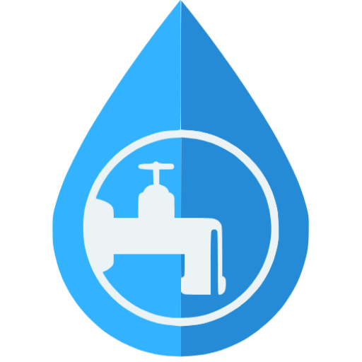

<div align="center">
  

  # AGUA-VP
  ### Sistema de Gestión de Agua Potable

  [](docs/releases_changelog.md)
  []()
  []()
</div>

---

## 📌 ¿Qué es AGUA-VP?

**AGUA-VP** es una aplicación de escritorio diseñada para la administración de comités y organismos locales de agua potable. Permite gestionar el ciclo operativo del servicio: padrón de clientes, control de medidores, captura de lecturas por rutas, cálculo de consumos, cobro de recibos y emisión de reportes.

La aplicación funciona de forma **local (offline)**; no requiere conexión a internet para su operación diaria y almacena sus datos en una base de datos SQLite integrada en el equipo.

---

## 🏛️ Estructura general de la aplicación

La aplicación está compuesta por tres partes principales:

- **Interfaz de usuario (Frontend):** Desarrollada con React, Vite y Tailwind CSS, ofreciendo una navegación ágil y modular con soporte de modo oscuro.
- **Proceso de escritorio (Electron):** Controla la ventana de la aplicación, el ciclo de vida del sistema, respaldos automáticos y la comunicación segura con el sistema operativo.
- **Base de datos y lógica local (Backend embebido):** Servidor local interno con Express y base de datos SQLite (Better-SQLite3) con migraciones automáticas para el resguardo de la información.

---

## 📦 Módulos del sistema

Si requieres conocer a detalle el funcionamiento de cada apartado, consulta su documentación:

| Módulo | Descripción general | Documentación |
|---|---|:---:|
| **Clientes** | Registro de usuarios, asignación de predios, medidores y tarifas | [Ver guía](docs/modulo-clientes.md) |
| **Medidores** | Inventario de equipos físicos, ubicación y estado | [Ver guía](docs/modulo-medidores.md) |
| **Lecturas y Rutas** | Organización de recorridos y captura de consumo | [Ver guía](docs/modulo-lecturas.md) |
| **Tarifas** | Configuración de precios por rangos de consumo | [Ver guía](docs/modulo-tarifas.md) |
| **Pagos y Facturación** | Cobranza en ventanilla, abonos y convenios | [Ver guía](docs/modulo-pagos.md) |
| **Impresión y Reportes** | Emisión de recibos de pago y reportes generales | [Ver guía](docs/modulo-impresion.md) |
| **Administración** | Usuarios del sistema, permisos y respaldos | [Ver guía](docs/modulo-administracion.md) |

---

## 🔄 Flujo de trabajo básico

```
1. Registrar clientes y vincularles su medidor y tarifa
        ↓
2. Organizar la ruta de recorrido
        ↓
3. Capturar las lecturas del período (el sistema calcula el consumo)
        ↓
4. Generar las facturas del mes
        ↓
5. Registrar los pagos en ventanilla
        ↓
6. Imprimir recibos y reportes
```

---

## 💻 Requisitos del sistema

- **Sistema operativo:** Windows 10 o Windows 11 (64 bits).
- **Memoria RAM:** 4 GB mínimo (8 GB recomendado).
- **Espacio en disco:** 500 MB libres.
- **Para desarrollo:** Node.js 18+ y npm 9+.

---

## 🛠️ Comandos de desarrollo

```bash
# Instalar dependencias
npm install

# Iniciar en modo desarrollo
npm run dev

# Compilar instalador para Windows (.exe)
npm run build:win

# Revisar formato y código
npm run lint
npm run format
```

Los instaladores generados se guardan en la carpeta `dist/`.

---

## 📁 Estructura del proyecto

```
AguaVP/
├── build/               # Recursos de empaquetado (iconos del instalador)
├── docs/                # Documentación detallada por módulo
├── resources/           # Recursos estáticos de la aplicación
├── src/
│   ├── main/            # Proceso principal de Electron (Node.js)
│   │   ├── ipc/         # Canales de comunicación por módulo
│   │   └── managers/    # Servidor embebido, respaldos y logs
│   ├── preload/         # Puente seguro entre el sistema y la interfaz
│   └── renderer/        # Interfaz de usuario (React + Vite)
│       └── src/
│           ├── components/  # Vistas y componentes visuales
│           ├── context/     # Estado global por dominio
│           └── hooks/       # Lógica reutilizable
├── package.json         # Dependencias y scripts
└── electron-builder.yml # Configuración de empaquetado para Windows
```

---

## 📄 Notas de versión

El historial de cambios y notas de cada lanzamiento se encuentra en el [Registro de Versiones (Changelog)](docs/releases_changelog.md).
