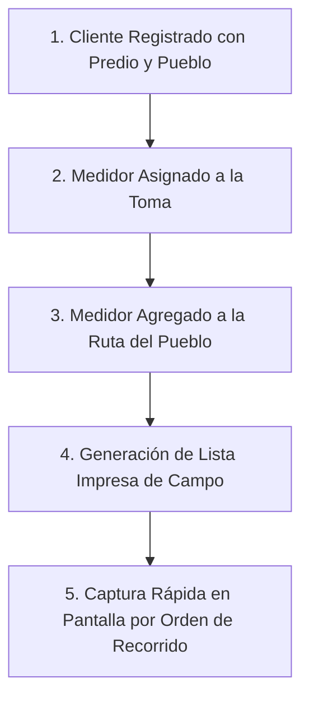

# 🗺️ Integración con Rutas de Lectura en Campo

Para que las lecturas de un cliente se puedan capturar durante la jornada mensual de campo, su medidor debe estar integrado dentro de una **Ruta de Lectura**.

---

## ⚙️ Cómo Funciona la Vinculación

1. **Ubicación Geográfica**: El cliente pertenece a un pueblo específico (*Nácori Grande*, *Mátape* o *Adivino*).
2. **Asignación del Medidor**: Al asociar el medidor al cliente, el equipo hereda la ubicación domiciliaria y el número de predio.
3. **Inclusión en la Ruta**: En el módulo de **Lecturas > Gestión de Rutas**, se agregan los medidores del sector a la ruta correspondiente.

---

## 📋 Beneficios Operativos de la Ruta

* **Orden Lógico de Recorrido**: Los lectores de campo recorren las calles en una secuencia ordenada sin dar vueltas innecesarias.
* **Impresión de Formatos de Campo**: La lista de toma de lecturas se imprime exactamente en el orden de las casas con la columna de lectura anterior prellenada.
* **Captura con Tecla `Enter`**: En el modal de captura rápida de AguaVP, los clientes aparecen secuencialmente, permitiendo ingresar lecturas a máxima velocidad.

> [!IMPORTANT]
> Si un cliente tiene medidor pero **no aparece en la lista de campo**, diríjase a **Lecturas > Rutas**, edite la ruta correspondiente a su localidad y agregue el medidor a la lista de puntos de inspección.
