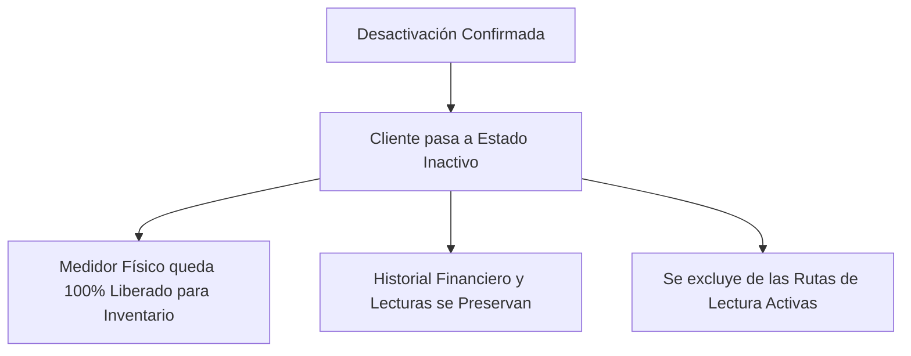

# ⚠️ Desactivación de Clientes y Zona de Peligro

En **AguaVP**, la eliminación de clientes está protegida por estrictos protocolos de seguridad y auditoría contable conocidos como **Desactivación Segura (*Soft Delete*)**.

---

## 🛡️ Filosofía de Seguridad y Auditoría Contable

> [!CAUTION]
> **No se destruye información histórica**: Cuando un cliente es desactivado, el sistema **NUNCA borra** sus recibos emitidos, pagos registrados ni el historial de consumos de agua de años anteriores. Toda esa información se conserva intacta en la base de datos para auditorías gubernamentales y balances anuales.

---

## 📋 Requisitos Obligatorios para Desactivar

Para evitar bajas accidentales, el formulario de **Zona de Peligro** exige cumplir con dos condiciones obligatorias:

1. **Motivo de Desactivación Obligatorio ($ge 10$ caracteres)**:
   * El operador debe escribir una justificación clara de la baja (ej. *"Cancelación de contrato por venta de predio"* o *"Contrato duplicado registrado por error"*).
   * Un contador visual indicará cuántos caracteres faltan hasta completar el mínimo requerido.
2. **Casilla de Verificación Explícita**:
   * El usuario debe marcar activamente el checkbox *"Confirmo que deseo desactivar este cliente"*.

---

## 🔄 ¿Qué Ocurre en el Sistema al Desactivar?

1. **Estado Inactivo**: El cliente deja de aparecer en las listas activas de cobro y facturación.
2. **Liberación Automática de Medidor**: El medidor que tenía asignado se desvincula de inmediato y queda disponible en color verde **"Libre"** en el inventario para poder asignarse a otra casa.
3. **Exclusión de Rutas**: La toma se retira de la lista física de campo del mes siguiente.

---

## ⚖️ Tabla de Decisión: ¿Qué Acción Corresponde?

| Situación | Acción Recomendada | ¿Por qué? |
| :--- | :---: | :--- |
| El cliente cambió de medidor | **Liberar y Asignar Medidor** | Mantiene la misma cuenta y solo actualiza el aparato físico. |
| El cliente se cambió de casa en el mismo pueblo | **Modificar Dirección y Predio** | Conserva el historial de pagos y actualiza el domicilio. |
| El cliente tiene adeudos pendientes | **Cobrar / Liquidar Primero** | Nunca desactive una cuenta con saldo sin documentar el pago. |
| Contrato cancelado definitivamente o predio demolido | **Desactivar Cliente (Zona de Peligro)** | Pasa a inactivo, libera el medidor y archiva el historial. |
