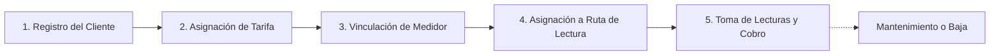

# 👥 Introducción al Módulo de Clientes

El módulo de **Clientes** es el núcleo administrativo del padrón de usuarios del sistema **AguaVP**. Desde este espacio se gestiona la totalidad de los contratos de suministro de agua potable para las localidades de **Nácori Grande**, **Mátape** y **Adivino**.

Este módulo centraliza la identidad de los usuarios, sus domicilios físicos, su esquema tarifario, la vinculación de medidores de agua y el historial financiero y de consumo.

---

## 🗺️ Ciclo de Vida del Contrato de Agua

---

## 🧭 Estructura y Navegación del Módulo

El módulo de Clientes se divide en **dos vistas operativas principales** accesibles mediante las pestañas superiores:

### 1. Directorio de Clientes (`TabClientes`)
Es la mesa de trabajo principal donde se visualiza la tabla completa del padrón:

* **Barra de Búsqueda Reactiva Multicriterio**: Permite localizar instantáneamente a cualquier usuario escribiendo su nombre, número de predio, teléfono, correo electrónico o número de serie de medidor.
* **Filtros Rápidos por Localidad y Estado**:
  * **Selector de Pueblo**: Filtra clientes exclusivamente de *Nácori Grande*, *Mátape* o *Adivino*.
  * **Selector de Estado**: Segmenta entre *Activos*, *Inactivos*, *Con Medidor Asignado* y *Sin Medidor*.
* **Tabla de Datos Interactiva**:
  * **Identidad**: Avatar, nombre completo del titular y badge distintivo del Número de Predio.
  * **Contacto**: Teléfono formateado a 10 dígitos y correo electrónico.
  * **Ubicación**: Pueblo y dirección domiciliaria completa.
  * **Tarifa**: Tipo de esquema de cobro asignado (Doméstica, Comercial, etc.).
  * **Medidor**: Número de serie del equipo vinculado y chip de estado.
  * **Acciones**: Botones directos para ver ficha técnica, editar datos o gestionar medidores.
* **Exportación Corporativa**: Botón para exportar el padrón filtrado a **Excel (.xlsx)** con formato formal de celdas o a **CSV (UTF-8)** para nóminas y auditorías municipales.

---

### 2. Métricas y Resumen (`TabMetricas`)
Panel analítico con indicadores en tiempo real sobre la salud del padrón:

* **Total de Clientes Registrados**: Volumen general de cuentas en el sistema.
* **Usuarios Activos vs. Inactivos**: Balance de cuentas al corriente contra bajas temporales o definitivas.
* **Cobertura de Micromedición**: Porcentaje de clientes que cuentan con medidor operativo vs. tomas con cuota fija.
* **Distribución Geográfica**: Concentración de usuarios por localidad (Nácori Grande, Mátape, Adivino).
* **Distribución Tarifaria**: Desglose de contratos según su categoría (Doméstica, Comercial, Preferencial).

---

## 📁 Expediente Digital del Cliente (`ModalDetalleCliente`)

Al hacer clic sobre cualquier fila de la tabla o en el botón de **Ver Ficha**, se despliega el expediente digital completo del usuario con 4 secciones clave:

1. **Resumen General**: Estado de la cuenta, número de predio, teléfono y tarifa activa.
2. **Historial de Facturación**: Relación cronológica de todos los recibos emitidos con sus consumos en $m^3$ e importes.
3. **Historial de Pagos y Liquidaciones**: Registro de transacciones en caja, folios de pago y métodos de cobro.
4. **Ficha del Medidor Actual**: Número de serie, marca, fecha de instalación y lectura inicial de arranque.

---

## ⚡ Buenas Prácticas de Operación

> [!TIP]
> **Antes de registrar una nueva toma**: Compruebe en el buscador si el titular o el predio ya existen para evitar duplicar contratos.

> [!IMPORTANT]
> **Consistencia Geográfica**: Asegúrese de que el pueblo asignado en la dirección coincida con la ruta de lectura de campo para que el medidor aparezca en la lista física de lecturas mensual.
