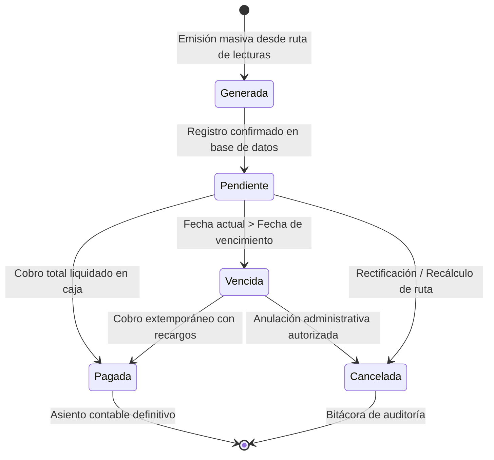

# 🔄 Ciclo de Vida y Estados de Facturas

Cada factura emitida en **AguaVP** transita por un ciclo de vida normado para garantizar la consistencia entre los consumos medidos en campo, el libro contable de ingresos y los arqueos diarios de caja.

---

## 🗺️ Diagrama de Transición de Estados

---

## 📌 Definición Rigurosa de los Estados

### 1. 🟡 Pendiente (Vigente para cobro)
* **Condición**: La factura fue generada exitosamente al cerrar la ruta de lecturas.
* **Características**:
  * El saldo deudor está activo y vigente.
  * La fecha límite de vencimiento aún no ha expirado.
  * Es cobrable de inmediato mediante Pago Rápido o Pago Distribuido.

### 2. 🟢 Pagada (Liquidada al 100%)
* **Condición**: Se registró un pago que cubre la totalidad del importe facturado.
* **Características**:
  * Queda vinculada de manera inmutable al folio de transacción (`#P-...`) y al comprobante de caja.
  * **Inmutabilidad Contable**: No puede modificarse ni recalcularse para proteger los cortes de caja de la tesorería municipal.

### 3. 🔴 Vencida (En mora)
* **Condición**: La fecha del sistema superó la fecha límite de pago sin que se haya liquidado el saldo total.
* **Características**:
  * Se activan automáticamente los recargos por mora según la tarifa vigente.
  * Suma al conteo de períodos adeudados del cliente para la alerta de **Corte de Servicio** (al acumular 2 o más recibos vencidos).

### 4. ⚫ Cancelada (Anulada)
* **Condición**: Factura dada de baja por recálculo masivo de la ruta o rectificación autorizada de la lectura.
* **Características**:
  * El saldo deudor se anula en el estado de cuenta del usuario.
  * El movimiento queda registrado permanentemente en la bitácora de auditoría con la justificación técnica del cajero o administrador.

---

## ⚡ Reglas de Negocio

> [!CAUTION]
> **Protección de Facturas Pagadas**: Una factura con estado **Pagada** no puede ser cancelada ni recalculada por procesos automáticos. Si existió un cobro indebido, se debe procesar una bonificación o nota de crédito administrativa en ventanilla.
