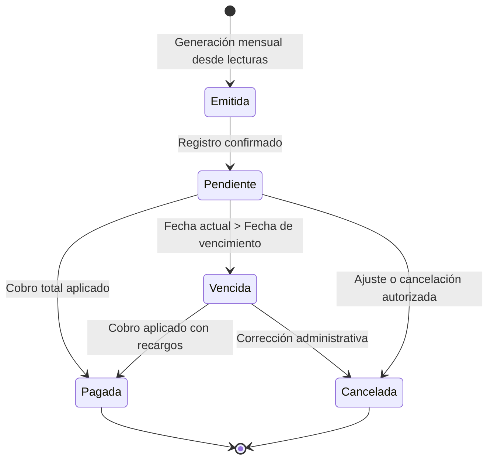

# Ciclo de Vida y Estados de Facturas

Este documento describe la arquitectura de datos, la máquina de estados y las reglas de negocio que rigen la emisión y control de facturas en **AguaVP**.

---

## 🔄 Máquina de Estados de una Factura

Cada factura generada en el sistema transita a través de un conjunto finito de estados:

---

## 📌 Definición de Estados

### 1. Pendiente (Vigente para cobro)
- La factura fue generada automáticamente a partir del consumo registrado en el módulo de lecturas.
- El saldo deudor está activo y la fecha límite de pago aún no ha expirado.
- Es visible en el punto de cobro rápido de ventanilla.

### 2. Pagada (Liquidada)
- Se aplicó un pago que cubre la totalidad del importe facturado.
- Se asocia de manera inmutable al identificador de la transacción (`id_pago`) y comprobante fiscal/ticket emitido.
- No puede modificarse ni eliminarse sin una anulación formal de la transacción en caja.

### 3. Vencida (En mora)
- Se activa cuando la fecha del sistema supera la fecha de corte o vencimiento sin que se haya registrado el pago total.
- El sistema puede aplicar automáticamente recargos por mora o intereses según la configuración de la tarifa.
- Computa para la acumulación de meses en la cartera vencida del cliente.

### 4. Cancelada (Anulada)
- Estado reservado para facturas generadas por error o modificadas debido a una rectificación de lectura posterior.
- Queda registrada en bitácora para trazabilidad y auditoría.
