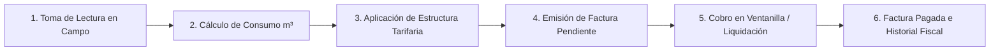

# 🧾 Introducción al Módulo de Facturas

El módulo de **Facturas** es el sistema de control y administración de los comprobantes oficiales de cobro por el suministro de agua potable en **AguaVP**. Centraliza la emisión mensual de recibos generados a partir de las lecturas de campo para las localidades de **Nácori Grande (`NG-`)**, **Mátape (`MP-`)** y **Adivino (`AD-`)**.

A través de esta plataforma se supervisa el saldo deudor de cada contrato, el desglose tarifario por bloques de consumo en metros cúbicos ($m^3$), las fechas de vencimiento y el estado de liquidación de cada cuenta.

---

## 🗺️ Ciclo de Vida de la Facturación

---

## 🧭 Estructura y Navegación del Módulo

La vista de **Facturas** (`TabFacturas`) organiza la información en un entorno ágil con herramientas avanzadas de auditoría:

### 1. Panel de Indicadores de Facturación (KPIs en Tiempo Real)
En la cabecera se presentan cuatro tarjetas analíticas que reflejan el estado del período seleccionado:

| Indicador KPI | Código Color | Significado Operativo |
| :--- | :---: | :--- |
| **Facturado Total** | 🔵 Azul | Monto financiero global ($ MXN) emitido en el período activo. |
| **Facturas Pendientes** | 🟠 Naranja | Cantidad de recibos con saldo deudor vigente pendientes de cobro. |
| **Facturas Pagadas** | 🟢 Esmeralda | Cantidad de facturas completamente liquidadas en caja. |
| **Facturas Vencidas** | 🔴 Rosa | Recibos cuya fecha límite de pago expiró sin registrarse liquidación. |

---

### 2. Filtros y Búsqueda por Período
* **Selector de Período Avanzado (`SelectorPeriodoAvanzado`)**: Permite auditar facturaciones de meses y años históricos o consultar el período corriente (ej. `2026-09`).
* **Buscador Multicriterio**: Localiza cualquier factura escribiendo el nombre del cliente, número de predio, dirección o folio de factura.
* **Filtro por Estado de Cobro**: Segmenta la tabla entre *Todas*, *Pendientes*, *Pagadas*, *Vencidas* y *Canceladas*.

---

### 3. Tabla Maestra de Facturas
* **Folio y Predio**: Identificador oficial (`#Factura`) y badge distintivo del predio catastral.
* **Cliente y Medidor**: Nombre del titular, dirección y número de serie troquelado del medidor.
* **Consumo y Tarifa**: Metros cúbicos ($m^3$) medidos en el período y tarifa asignada (Doméstica, Comercial, etc.).
* **Importes**: Desglose entre **Monto Total Facturado** y **Saldo Pendiente**.
* **Estado de la Factura**: Chip distintivo de estado con código de color.
* **Acciones Directas**:
  * **👁️ Ver Detalle (`ModalDetalleFactura`)**: Despliega el desglose matemático de la tarifa, lecturas de odómetro y saldo acumulado.
  * **💳 Pagar Factura (`ModalPago`)**: Acceso directo a la pasarela de cobro en ventanilla para liquidar la factura seleccionada.

---

### 4. Exportación Institucional de Datos
Permite descargar el registro de facturación en formatos **Excel (.xlsx)** y **CSV (UTF-8)** con tres alcances seleccionables:
1. *Página actual visible*.
2. *Facturas filtradas en pantalla*.
3. *Padrón de facturación completo del período*.

---

## ⚡ Buenas Prácticas de Operación

> [!IMPORTANT]
> **Generación desde Rutas**: Recuerde que las facturas no se crean manualmente una por una; se generan en bloque de forma masiva desde el módulo de **Lecturas** al completar el $100\%$ de captura de una ruta.

> [!TIP]
> **Atención en Ventanilla**: Si un cliente se presenta a pagar un recibo específico, localícelo rápidamente en esta pestaña mediante su número de predio y presione el botón **💳 Pagar** para asentar el cobro de inmediato.
