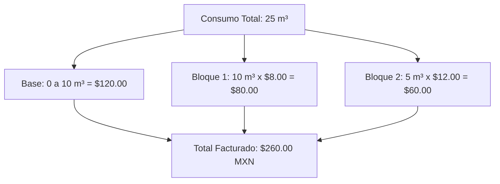

# 📐 Lógica de Cálculo y Desglose Tarifario

Este documento detalla el modelo matemático y la arquitectura tarifaria implementada en el motor de facturación de **AguaVP** para calcular con precisión los importes de cobro a partir de los metros cúbicos ($m^3$) consumidos.

---

## 🧮 Modelo Matemático de Facturación

El costo total de una factura $C_{\text{total}}$ se calcula mediante la siguiente ecuación general:

$$C_{\text{total}} = C_{\text{base}} + \sum_{i=1}^{n} (V_i \times P_i) + R_{\text{mora}} + A_{\text{adicionales}}$$

### Parámetros de la Ecuación:
* **$C_{\text{base}}$**: Cuota fija mensual del servicio que incluye un volumen base de agua $V_{\text{base}}$ (ej. $10 \text{ m}^3$).
* **$V_{\text{consumo}}$**: Volumen total medido en el período $(\text{Lectura Actual} - \text{Lectura Anterior})$.
* **$V_{\text{excedente}}$**: Volumen que sobrepasa la cuota base: $\max(0, V_{\text{consumo}} - V_{\text{base}})$.
* **$V_i$**: Volumen en metros cúbicos que cae dentro del bloque escalonado $i$.
* **$P_i$**: Precio unitario por metro cúbico asignado al bloque $i$.
* **$R_{\text{mora}}$**: Recargo por pago extemporáneo si la factura se encuentra en estado vencido.
* **$A_{\text{adicionales}}$**: Cuotas especiales de alcantarillado, saneamiento o convenios autorizados.

---

## 📊 Ejemplo Práctico de Descomposición por Bloques

Supongamos una tarifa doméstica municipal con la siguiente estructura:
* **Cuota Base**: $120.00 MXN (incluye hasta $10 \text{ m}^3$).
* **Bloque 1 (11 a 20 $m^3$)**: $8.00 MXN por $m^3$ excedente.
* **Bloque 2 (21 a 35 $m^3$)**: $12.00 MXN por $m^3$ excedente.
* **Bloque 3 (Más de 35 $m^3$)**: $18.00 MXN por $m^3$ excedente.

Si un suscriptor registra un consumo de **$25 \text{ m}^3$** en el mes:

1. **Cuota Base (0 a 10 $m^3$)**: $120.00
2. **Bloque 1 (10 $m^3$ excedentes)**: $10 \times \$8.00 = \$80.00$
3. **Bloque 2 (5 $m^3$ excedentes)**: $5 \times \$12.00 = \$60.00$
4. **Total Facturado**: $$120.00 + \$80.00 + \$60.00 = \mathbf{\$260.00 \text{ MXN}}$

---

## 📁 Expediente y Desglose de Factura (`ModalDetalleFactura`)

Al hacer clic en el botón de **Detalle (👁️)** de cualquier factura, se abre la ventana con el desglose auditado:

1. **Datos del Usuario y Toma**: Titular, número de predio, dirección y serie del medidor.
2. **Lecturas de Odómetro**: Lectura anterior registrada, lectura actual y fecha de corte.
3. **Desglose de Conceptos**: Detalle en renglones separados de la cuota base, el importe por excedente y los recargos si aplican.
4. **Estado Financiero**: Saldo total de la factura, abonos recibidos y saldo pendiente de liquidación.

---

## ⚡ Conclusión Técnica

> [!NOTE]
> El esquema escalonado por bloques garantiza la sostenibilidad financiera del sistema municipal al tiempo que promueve el ahorro de agua penalizando el desperdicio.
