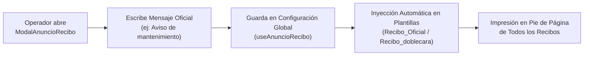
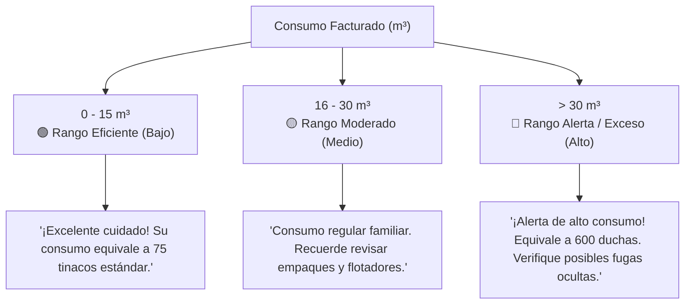

# Configuración de Recibos y Cultura del Agua

La pestaña **Configuración Visual** permite personalizar el contenido pedagógico e institucional que acompaña a los recibos de agua. Lejos de ser un simple comprobante de cobro, el recibo de **AguaVP** está diseñado como un canal de comunicación directo entre la institución y la comunidad para difundir avisos oficiales y promover el cuidado responsable del agua potable.

---

## 📢 1. Aviso / Anuncio Institucional en Recibos

El **Aviso Institucional** es un mensaje global que se imprime de forma automática en el pie de página de **todos los recibos y tickets** emitidos en el período.

### Casos de Uso Frecuentes

* **Fechas Límites y Descuentos**: *"Pague antes del 15 de este mes y obtenga un 10% de descuento por pronto pago."*
* **Mantenimiento en la Red**: *"Aviso: Se realizarán trabajos de mantenimiento en el pozo principal el día 22; tome precauciones."*
* **Asambleas y Avisos Comunitarios**: *"Próxima asamblea general ordinaria el domingo 10 a las 10:00 hrs en el auditorio."*
* **Horarios y Sucursales de Atención**: *"Nuevo horario de cajas: Lunes a Viernes de 8:00 a 16:00 hrs."*

### Cómo Actualizar el Anuncio

1. Diríjase a la pestaña **Configuración Visual** dentro del módulo de Impresión.
2. En la sección **Aviso / Anuncio Institucional**, presione el botón **Editar Anuncio** (`ModalAnuncioRecibo`).
3. Redacte el mensaje deseado en el cuadro de texto (se recomienda un texto conciso de no más de 200 caracteres para asegurar una legibilidad óptima).
4. Haga clic en **Guardar**. El mensaje se aplicará de inmediato a todos los recibos que se generen o reimpriman a partir de ese momento.

---

## 💧 2. Equivalencias de Consumo y Cultura del Agua

El sistema de **Equivalencias de Consumo** convierte la cifra técnica de metros cúbicos ($m^3$) facturados en analogías cotidianas y comprensibles para el usuario y su familia.

El motor de plantillas clasifica automáticamente el consumo del cliente en uno de tres rangos pedagógicos y selecciona una frase educativa aleatoria correspondiente a ese nivel:

---

## 🎯 Los Tres Rangos de Clasificación Hídrica

| Rango de Consumo | Nivel de Uso | Enfoque Pedagógico del Mensaje | Impacto en el Usuario |
| :--- | :--- | :--- | :--- |
| **0 a 15 $m^3$** | 🟢 **Uso Eficiente (Bajo)** | Reconocimiento, felicitación y refuerzo de hábitos sostenibles. | Motiva al usuario a mantener su consumo bajo y cuidar el bolsillo. |
| **16 a 30 $m^3$** | 🟡 **Uso Moderado (Medio)** | Comparativa con el consumo familiar típico y recomendaciones preventivas. | Crea conciencia sobre el uso diario en duchas, lavado y cocina. |
| **Más de 30 $m^3$** | 🔴 **Alerta / Exceso (Alto)** | Advertencia clara de sobreconsumo, equivalencias impactantes y sugerencia de revisión de fugas. | Reduce reclamos en ventanilla al evidenciar que el volumen fue atípico y orienta a buscar fugas en cisternas o tinacos. |

---

## 🛠️ Personalización de Frases (`ModalEquivalenciaConsumo`)

El operador o administrador puede editar, agregar o eliminar las frases pedagógicas asignadas a cada uno de los tres rangos:

1. Presione el botón **Editar Equivalencias** en la sección de Cultura del Agua.
2. Seleccione la pestaña del rango que desea personalizar (**Eficiente**, **Moderado** o **Alto**).
3. Agregue nuevas analogías o modifique las existentes.
4. Presione **Guardar Cambios**.

---

## 💡 Beneficios Operativos y Sociales

> [!TIP]
> **Disminución de Disputas en Ventanilla**: La mayoría de las inconformidades de los usuarios provienen de no entender cuánta agua representan "$35 m^3$". Al leer en su recibo que equivale a *"más de 700 descargas de inodoro o 14 pipas de agua"*, el usuario comprende la magnitud de su gasto y asume la responsabilidad de revisar sus instalaciones antes de reclamar.

> [!NOTE]
> **Educación Familiar**: Las equivalencias didácticas están redactadas en un lenguaje accesible para niños y jóvenes, convirtiendo el recibo mensual en una herramienta de educación ambiental en el hogar.
