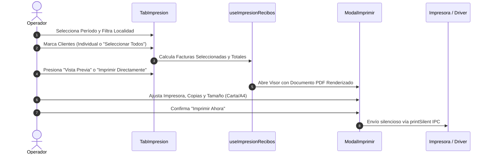

# Emisión e Impresión Masiva de Recibos

La pestaña **Impresión General** permite generar y mandar a imprimir los recibos de cobro de agua potable correspondientes a un período determinado. El sistema ofrece control total sobre qué recibos emitir, cómo ordenarlos para el reparto en calle y a qué dispositivo físico enviarlos.

---

## 🛠️ Flujo de Trabajo Paso a Paso

---

## 1. Selección del Período y Clientes

En la columna izquierda de la pantalla encontrará el componente **ClientesList**:

1. **Selector de Período**: Seleccione el mes y año que desea emitir (ej: *Septiembre de 2026*). El sistema cargará automáticamente todas las facturas generadas para ese ciclo.
2. **Casilla de Selección Global**: Use el botón o casilla superior para marcar/desmarcar todos los usuarios de una sola vez.
3. **Selección Individual**: Haga clic sobre la fila de cualquier cliente para incluirlo o excluirlo del lote actual.
4. **Filtro Rápido por Localidad**: Permite aislar los clientes pertenecientes a un sector o comunidad específica (ej: *Barrio San Pedro*, *Centro*).

---

## 2. Panel Lateral de Acciones y Resumen

En la columna derecha (*Sticky*), el panel **Acciones de Impresión** se actualiza en tiempo real conforme selecciona usuarios:

* **Recibos Seleccionados**: Conteo exacto de facturas que conformarán la tirada.
* **Importe Total**: Sumatoria en pesos ($) pendiente de cobro en el lote.
* **Consumo Total**: Volumen global facturado en metros cúbicos ($m^3$).
* **Criterio de Ordenamiento**:
  * **Por Número de Predio**: *(Recomendado para reparto físico)* Ordena los recibos siguiendo la secuencia de predios de las rutas de lectura para facilitar la entrega casa por casa.
  * **Por ID Secuencial**: Orden numérico según el folio de registro del cliente.

---

## 3. Visor de Alta Fidelidad y Configuración de Hardware

Al presionar **Vista Previa** o **Imprimir**, se abre el modal interactivo `ModalImprimir` impulsado por el motor de renderizado PDF:

### Opciones de Hardware Disponibles

| Opción | Descripción y Ajustes |
| :--- | :--- |
| **🖨️ Impresora de Destino** | Menú desplegable con todas las impresoras instaladas en Windows. Incluye botón **Actualizar (↻)** para detectar nuevas impresoras conectadas sin reiniciar el programa. |
| **📄 Tamaño de Papel** | Selección entre formatos estándar: **Carta (Letter)**, **A4** y **Legal (Oficio)**. |
| **🔄 Orientación** | Alternar entre **Horizontal (Landscape)** y **Vertical (Portrait)** según el formato de la plantilla. |
| **🔢 Cantidad de Copias** | Selector numérico (+ / -) para emitir duplicados o copias de archivo. |
| **💾 Guardar PDF** | Exporta el documento compuesto a un archivo `.pdf` en cualquier carpeta del disco duro. |
| **🖥️ Diálogo OS** | Abre el asistente nativo de impresión de Windows para usuarios que requieran ajustes avanzados del driver (resolución DPI, bandejas de papel especiales). |

---

## 📄 Características de la Plantilla de Recibo

La plantilla oficial de **AguaVP** está diseñada para optimizar el uso de insumos de papelería:

* **Diseño Multitanto / Doble Cara**: Distribuye 2 o 4 recibos por hoja con reverso coordinado (*Short Edge / Borde Corto*).
* **Talonario Desprendible**: Incluye sección para el usuario y talón de caja para la oficina de cobro con código de barras y folio único.
* **Histórico de Consumo Gráfico**: Incluye barras comparativas de los últimos 6 meses para que el usuario monitoree sus hábitos.
* **Aviso Institucional Integrado**: Mensaje oficial configurado en el sistema impreso al pie de página.
* **Equivalencia de Cultura del Agua**: Frase educativa adaptada al volumen de metros cúbicos consumidos.

---

## ⚠️ Puntos Clave de Control

> [!WARNING]
> **Cero Clientes Seleccionados**: El botón de emisión permanecerá deshabilitado si no hay al menos un cliente marcado en la lista.

> [!IMPORTANT]
> **Estado de las Facturas**: Los recibos reflejan el estado de la factura al momento de la impresión. Si una factura ya fue pagada en ventanilla, se imprimirá con el sello de **PAGADO** y saldo en cero. Si tiene deuda acumulada de meses previos, mostrará el desglose de rezagos pendientes.
