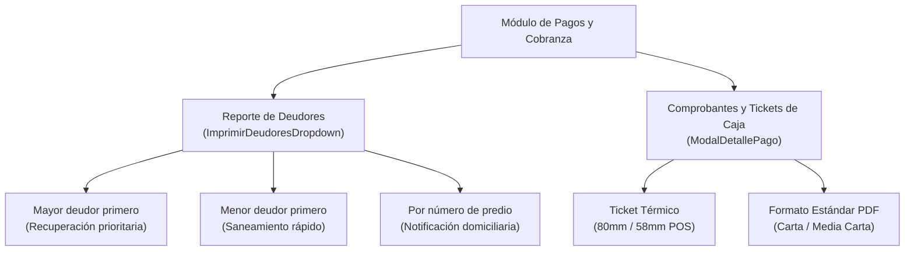

# Impresión y Reportes desde Otros Módulos

En **AguaVP**, la capacidad de emisión física y generación de reportes no se limita a la vista central de Impresión. Las herramientas de reporte están distribuidas estratégicamente en los módulos operativos donde se toman las decisiones: **Pagos / Cobranza**, **Lecturas** y **Clientes**.

Esta arquitectura permite al operador generar comprobantes y reportes especializados con un solo clic sin abandonar su flujo de trabajo.

---

## 💳 1. Emisión en el Módulo de Pagos y Cobranza

El módulo de **Pagos y Cobranza** dispone de dos mecanismos de impresión fundamentales para la gestión financiera diaria:

### A. Reporte de Deudores (`ReporteDeudoresMayores`)

Ubicado en la pestaña principal de **Cobranza por Cliente**, el botón desplegable **Imprimir Deudores** permite emitir la lista de usuarios con saldos pendientes ordenados bajo tres criterios estratégicos:

1. **Mayor Deudor Primero**: *(Enfoque Coactivo / Legal)* Ordena la lista comenzando por las cuentas con el adeudo más elevado. Es la herramienta principal para la dirección y el área jurídica para programar convenios de pago o cortes de servicio por morosidad crítica.
2. **Menor Deudor Primero**: *(Enfoque de Saneamiento Rápido)* Muestra primero a los clientes que adeudan montos menores (1 o 2 meses de rezago), ideal para campañas de regularización rápida vía llamadas o mensajes.
3. **Por Número de Predio**: *(Enfoque Territorial de Campo)* Ordena la cartera vencida siguiendo la traza de las calles y predios. Es el listado que se entrega a los notificadores para entregar citatorios o requerimientos de pago casa por casa sin duplicar traslados.

### B. Comprobantes y Tickets de Caja (`ComprobantePago`)

Cada vez que se registra una transacción en ventanilla (mediante **Pago Rápido**, **Cobro Express** o **Abono Distribuido**):

* Se abre automáticamente el **Modal de Detalle de Pago** (`ModalDetallePago`).
* Permite imprimir el comprobante oficial en impresora térmica de **80mm** o **58mm**, o en formato carta.
* **Reimpresión Histórica**: Desde la pestaña **Historial de Pagos**, el operador puede buscar cualquier transacción pasada y presionar **Imprimir Comprobante** en cualquier momento para entregar duplicados a los usuarios.

---

## 📖 2. Reportes en el Módulo de Lecturas

En el [Módulo de Lecturas](../lecturas/Introduccion.md), dentro de la pestaña **Métricas y Análisis**, se encuentra el generador del **Reporte de Avance y Estado de Lecturas** (`ReporteLecturasMetricas`):

### Contenido del Reporte Analítico

* **Porcentaje de Cobertura**: Gráfico de tomas completadas vs tomas pendientes por ruta.
* **Distribución de Consumo**: Volumen total capturado, promedio en $m^3$ por usuario e identificación de tomas con consumo cero o anomalías.
* **Resumen de Incidencias**: Conteo de medidores con candado, destruidos, ilegibles o con fuga reportada en campo.

---

## 👥 3. Reportes en el Módulo de Clientes

Desde la vista de [Clientes](../clientes/Introduccion.md), el operador puede generar directamente el padrón institucional filtrado por tarifa o estado, así como activar la exportación rápida de la agenda de contactos.

---

## 📊 Comparativa de Documentos y Salidas

| Documento | Módulo de Origen | Formato Típico | Destinatario Principal |
| :--- | :--- | :--- | :--- |
| **Recibos de Agua Mensuales** | Impresión General | Carta / 2-4 por hoja | Usuarios finales / Reparto en calle. |
| **Planilla de Toma de Lecturas** | Impresión / Reportes | Carta / Planilla tabular | Lecturistas y fontaneros en campo. |
| **Padrón General Institucional** | Impresión / Reportes | Carta / Membretado | Auditoría interna, Presidencia, CONAGUA. |
| **Listado de Cartera Deudora** | Pagos y Cobranza | Carta / Tabular | Notificadores de cobro y área jurídica. |
| **Ticket / Comprobante de Caja** | Pagos y Cobranza | Térmico 80mm / 58mm | Usuario que realiza el pago en caja. |
| **Reporte Métrico de Lecturas** | Lecturas / Métricas | Carta / Gráfico | Supervisores de red y directores de área. |
| **Bases de Datos XLSX / CSV** | Impresión / Reportes | Hoja de Cálculo / Texto | Sistemas contables externos y análisis BI. |

---

## 💡 Buenas Prácticas

> [!TIP]
> **Tickets Térmicos en POS**: Para impresoras térmicas de tickets (Epson, Star, Xprinter), configure el tamaño en **80mm** o **Roll Paper** en las propiedades del controlador de Windows para un corte de papel automático perfecto tras cada cobro.
