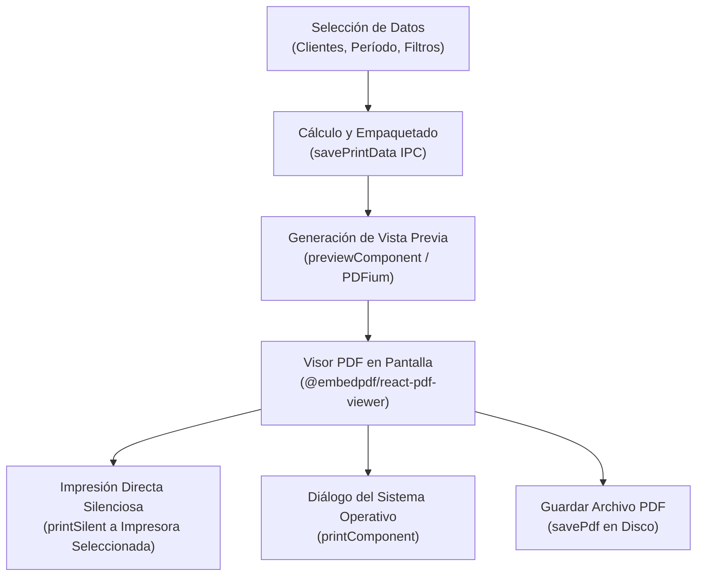
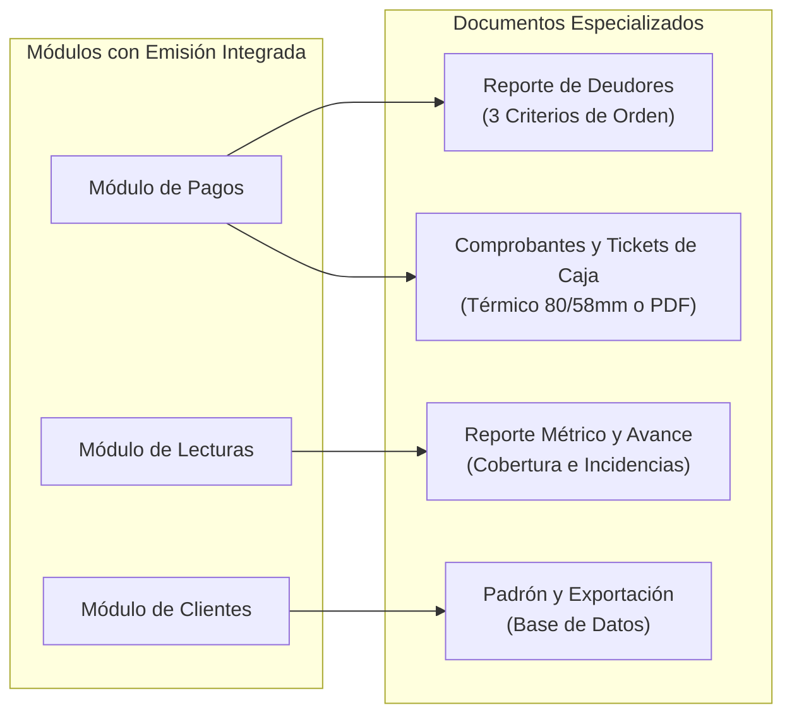

# Introducción al Módulo de Impresión y Reportes

El módulo de **Impresión y Reportes** es el centro neurálgico para la emisión física y digital de documentos en **AguaVP**. Su propósito es transformar los datos de contratos, medidores, tomas de lecturas, facturación y recaudación en formatos estandarizados listos para su impresión en papel térmico, hojas membretadas o exportación a archivos de análisis externo (**Excel** y **CSV**).

Diseñado con un enfoque moderno y seguro, el sistema integra un motor de previsualización en alta definición y un controlador de hardware que permite enviar trabajos directamente a impresoras locales o de red sin depender exclusivamente del navegador.

---

## 📑 Pestañas Principales del Módulo

La interfaz de **Impresión** se organiza en tres pestañas especializadas accesibles desde la barra superior:

| Pestaña | Propósito Operativo | Salidas Generadas |
| :--- | :--- | :--- |
| **🖨️ Impresión General** | Emisión masiva o selectiva de recibos mensuales de agua para los usuarios. | Recibos oficiales en formatos de 2 o 4 tantos por hoja con reverso coordinado. |
| **📋 Reportes y Listas** | Generación de hojas de campo para lecturas, padrón general y exportaciones. | Planillas de toma con `LECT. ANT.`, Censo clasificado, archivos `.xlsx` y `.csv`. |
| **⚙️ Configuración Visual** | Personalización de mensajes institucionales y pedagogía del agua en tickets. | Avisos de corte/mantenimiento y equivalencias didácticas de consumo ($m^3$). |

---

## 📊 Métricas y Estadísticas Globales (KPIs)

En la parte superior de la vista se presenta una barra de indicadores en tiempo real que resume el impacto del período de facturación cargado:

* **🖨️ Recibos**: Cantidad total de facturas emitidas y listas para impresión en el período activo.
* **💵 Facturado ($)**: Importe monetario total consolidado de todas las facturas del lote.
* **💧 Consumo Total ($m^3$)**: Volumen global de agua potable registrado en los medidores durante el mes.
* **📈 Promedio ($m^3$)**: Consumo medio por usuario, facilitando la detección de anomalías o sobreconsumo colectivo.

---

## 🔄 Arquitectura del Flujo de Impresión

El sistema utiliza un puente seguro entre la interfaz React y el proceso principal de Electron a través de canales IPC (*Inter-Process Communication*):

---

## 🌐 Matriz de Impresión Distribuida (Cross-Module)

Además del módulo central de Impresión, **AguaVP** dispone de herramientas de emisión integradas en los módulos operativos clave:

> [!NOTE]
> Para consultar el detalle de cómo emitir estos documentos desde sus áreas operativas correspondientes, consulte la guía [Impresión desde Otros Módulos](Impresi%C3%B3n%20desde%20Otros%20M%C3%B3dulos.md).

---

## 💡 Recomendaciones para la Operación Diaria

> [!TIP]
> **Use siempre la Vista Previa antes de tiradas masivas**: Antes de mandar a imprimir cientos de recibos o padrones extensos, verifique el alineamiento, saltos de página y que el mensaje institucional esté actualizado.

> [!IMPORTANT]
> **Consistencia del Período**: Al emitir recibos mensuales, asegúrese de haber concluido y recalculado las lecturas del mes correspondiente en el [Módulo de Lecturas](../lecturas/Introduccion.md) para garantizar que los importes y consumos sean los definitivos.

---

## 📚 Guías de esta Sección

1. **[Emisión e Impresión Masiva de Recibos](Impresi%C3%B3n%20de%20Recibos.md)**: Selección por lotes, filtros por localidad, configuración de hardware y plantillas oficiales.
2. **[Reportes Operativos y Exportación de Datos](Reportes%20y%20Exportaci%C3%B3n.md)**: Planillas de toma de lecturas, padrón general de clientes y descarga en Excel/CSV.
3. **[Impresión desde Otros Módulos](Impresi%C3%B3n%20desde%20Otros%20M%C3%B3dulos.md)**: Reportes de deudores, tickets de caja en Pagos y reportes analíticos en Lecturas.
4. **[Configuración de Recibos y Cultura del Agua](Configuraci%C3%B3n%20de%20Recibos%20y%20Cultura%20del%20Agua.md)**: Avisos en pie de página y equivalencias de consumo didácticas.
