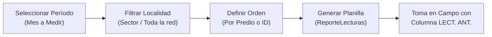
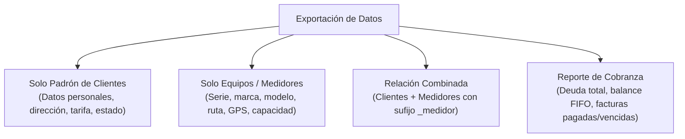

# Reportes Operativos y Exportación de Datos

La pestaña **Reportes y Listas** proporciona herramientas para la gestión operativa en campo, el control administrativo del padrón de usuarios y la extracción de información en formatos universales (**Excel** y **CSV**) para auditorías o análisis externo.

---

## 📋 1. Reporte de Lecturas Mensual (Planilla de Campo)

Este reporte está diseñado específicamente para los **lecturistas o fontaneros** que recorren las rutas físicas tomando la lectura de los medidores cada fin de mes.

### Estructura de la Planilla Impresa

* **Encabezado Institucional**: Período operativo, nombre de la localidad y fecha de emisión.
* **Columna `LECT. ANT.` (Lectura Anterior)**: Muestra el valor de cierre del mes anterior ya registrado en el sistema. Esto permite al lecturista comparar en campo y detectar si el medidor dio la vuelta (*rollover*), se detuvo o presenta una lectura incoherente.
* **Casillas en Blanco para Llenado Manual**:
  * **Lectura Actual**: Casilla para anotar los metros cúbicos observados en la carátula.
  * **Fecha de Toma**: Día exacto de la visita.
  * **Incidencias**: Códigos de anomalía (medidor roto, fuga en cuadro, perro bravo, predio deshabitado).
  * **Firma**: Rúbrica de conformidad del lecturista.

---

## 👥 2. Padrón General de Clientes

El **Padrón General** genera un censo exhaustivo y formal de todas las tomas de agua registradas en la institución.

### Opciones de Configuración

| Parámetro | Opciones | Uso Recomendado |
| :--- | :--- | :--- |
| **Ordenar por** | • **N° de Predio** • **Nombre (A - Z)** | • *Predio*: Para inspecciones territoriales. • *Nombre*: Para consultas directas de ventanilla. |
| **Agrupación** | • **Por Ciudad / Localidad** • **Por Tarifa** • **Sin agrupar (Plano)** | • *Ciudad*: Para coordinar comités comunitarios. • *Tarifa*: Para análisis de ingresos por segmento (Doméstico vs Comercial). |

Al pulsar **Vista Previa** o **Imprimir Padrón**, el sistema compagina automáticamente los registros con numeración de páginas corrida (ej: *Página 3 de 15*).

---

## 💾 3. Exportación Universal de Base de Datos

El motor de exportación permite descargar conjuntos de datos completos en formato de hoja de cálculo **Excel (`.xlsx`)** o texto plano delimitado **CSV (`.csv` UTF-8)**:

### Conjuntos de Datos Disponibles

1. **Solo Padrón de Clientes**: Exporta el listado completo con ID, nombre, número de predio, dirección, teléfono, correo, tarifa asignada y estado (Activo/Inactivo).
2. **Solo Equipos (Medidores)**: Exporta el inventario de medidores con número de serie, ruta asociada, marca, modelo, ubicación física, coordenadas geográficas (Lat/Lng), fecha de instalación, lectura base y capacidad máxima.
3. **Relación Clientes + Medidores (Combinado)**: Cruza en una sola fila toda la información del contrato con su medidor enlazado. Para evitar confusiones, los campos del equipo se identifican claramente con el sufijo `_medidor` (ej: `Número de Serie_medidor`, `Marca_medidor`).
4. **Reporte de Cobranza por Cliente**: Genera un balance financiero consolidado por usuario con la deuda total acumulada en pesos ($), conteo de facturas pagadas, facturas pendientes y facturas vencidas calculado bajo el esquema FIFO.

---

## 💡 Recomendaciones Técnicas

> [!TIP]
> **Compatibilidad con Hojas de Cálculo**: Las exportaciones en formato `.xlsx` generan columnas autoajustadas con encabezados estilizados listos para su uso en Excel, LibreOffice Calc o Google Sheets sin necesidad de formateo manual adicional.

> [!NOTE]
> **Archivos CSV UTF-8**: Si exporta en formato `.csv` para importación en otros sistemas de contabilidad gubernamental, el archivo incluye codificación UTF-8 para preservar acentos, caracteres especiales y la letra 'Ñ'.
