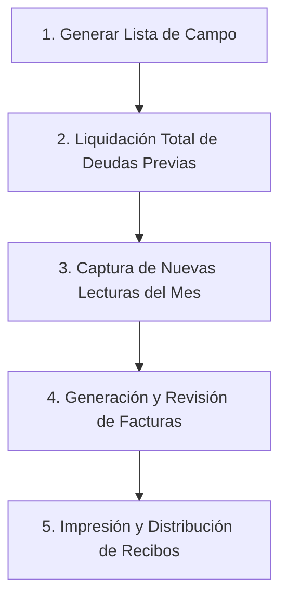

# 📅 Guía de Acción del Mes: Ciclo Completo de Operación

Esta guía es el **manual operativo principal** para coordinar el trabajo de campo y ventanilla durante el cierre e inicio de cada periodo mensual de cobro de agua.

El éxito del ciclo mensual depende de seguir estrictamente el orden de las 5 fases operativas para evitar desfases en los saldos de los clientes.

---

## 🗺️ Resumen del Ciclo Operativo Mensual

---

## 1️⃣ Fase 1: Generación de la Lista de Toma de Lecturas en Campo

Antes de que el personal de campo salga a tomar lecturas en las calles y colonias, se debe imprimir la **Lista de Lecturas** con el registro de la lectura anterior de cada medidor.

### Pasos para generar la lista:
1. Diríjase al menú lateral y seleccione **Impresión > Reportes y Listas**.
2. Seleccione el **Pueblo / Localidad** y el **Periodo (Mes y Año)** correspondiente.
3. Haga clic en **"Vista Previa"** o **"Imprimir"**.
4. Se abrirá una ventana modal con el formato de captura para los lectores.

> [!IMPORTANT]
> **Verificación previa**: Es fundamental comprobar que la columna **"LECT. ANT."** (Lectura Anterior) contenga los valores correctos antes de entregar el formato al personal de campo.

---

## 2️⃣ Fase 2: Proceso de Liquidación de Deudas Previas

> [!CAUTION]
> **Regla de Oro Operativa**: Es **obligatorio** realizar el corte y liquidación de adeudos del periodo anterior **antes** de registrar las nuevas lecturas.  
> **Orden correcto:** Primero liquidar adeudos antiguos $\rightarrow$ después capturar la nueva lectura mensual.

Para gestionar cobros masivos y regularizar los pagos pendientes del mes anterior:

### Pasos en Liquidación Total:
1. Abra el apartado de **Liquidación Total** o **Lista de Deudores**.
2. En la lista desplegada, **marque únicamente a los clientes que "Siguen debiendo"**. El sistema asumirá automáticamente que todos los clientes desmarcados ya realizaron su pago.

3. Presione el botón **"Revisar y confirmar"** en la parte inferior para visualizar el resumen financiero.
4. Si los importes son correctos, presione **"Liquidar [X] clientes"** y confirme en el cuadro de diálogo seleccionando **"Sí, registrar ahora"**.

5. El sistema procesará las transacciones y mostrará una **alerta verde de confirmación** indicando que la liquidación se registró con éxito.

6. La tabla de cartera se actualizará de inmediato, dejando al día las cuentas de los usuarios liquidados.

---

## 3️⃣ Fase 3: Registro de Nuevas Lecturas del Periodo

Una vez que el personal de campo regresa con la lista de lecturas anotadas:

1. Diríjase a **Lecturas > Registro de Lecturas**.
2. Seleccione el **Periodo de Lectura** en el selector superior.
3. Al seleccionar la ruta o sector, se habilitará una tarjeta con el estado de los clientes asignados.
4. Presione el botón **"Tomar Lecturas"**.

---

### ⌨️ Uso del Modal de Captura Rápida

Al abrir la ventana de captura interactiva:

1. **Ingreso de valor**: Capture los números que marca el medidor en el campo **Lectura Actual**.
2. **Cálculo automático**: El sistema calculará al instante el consumo en metros cúbicos ($m^3$) restando la lectura anterior.

3. **Prevención de errores de dedo**: Si ingresa una lectura menor a la anterior, aparecerá una alerta de advertencia en color naranja. Verifique si se trata de un error de captura o si el medidor físico dio la vuelta a su ciclo numérico ("vuelta a cero").

4. **Avance rápido**: Presione la tecla **`Enter`** para guardar. El sistema guardará el registro y avanzará automáticamente al siguiente cliente.
5. **Rectificación**: Si necesita corregir un dato ya ingresado, presione el botón **"Editar / Rectificar Lectura"**.

---

## 4️⃣ Fase 4: Generación de Facturas y Control de Recálculos

Cuando todas las lecturas de la ruta hayan sido capturadas, la tarjeta mostrará el progreso al **100%**.

1. Presione el botón azul **"Generar"** en la tarjeta de la ruta.

---

### ⚠️ Alerta Preventiva por Adeudos Anteriores

Si al intentar generar facturas aparece una ventana de alerta:

> **Significado**: Existen recibos pendientes de pago del periodo anterior que aún no fueron liquidados.  
> **Recomendación**: Lo ideal es regresar a la **Fase 2** (Liquidación Total) y registrar los cobros antes de generar.

Si decide continuar a pesar de la advertencia, el sistema **excluirá automáticamente el mes más reciente de la Liquidación Total** como medida de precaución para proteger los saldos nuevos.

---

### ✅ Confirmación y Generación Exitosa

Si todos los pagos previos están al corriente, el sistema presentará la ventana de confirmación regular:

1. Confirme la operación presionando **"Sí, generar"**.
2. El sistema creará los recibos aplicando las tarifas correspondientes y mostrará un resumen del procesamiento.

---

### 🔄 Estado Facturado y Función de Recálculo

- La tarjeta de la ruta cambiará su estado a **"Facturado"**.
- El botón **"Recalcular"** quedará disponible por si fuera necesario corregir una lectura previa.

> [!WARNING]
> **Condición de Recálculo**: El recálculo de facturas **únicamente se puede realizar mientras NO se hayan registrado pagos** para ese periodo. Una vez cobrada la primera factura, el periodo queda bloqueado para garantizar la consistencia contable.

---

## 5️⃣ Fase 5: Impresión y Distribución de Recibos

Para emitir los comprobantes físicos y entregarlos a los usuarios:

1. Diríjase al menú **Impresión > Impresión General**.
2. Seleccione el **Pueblo / Localidad** y el **Periodo** recién facturado.
3. Elija entre:
   - **"Imprimir"**: Para enviar directamente a la impresora configurada (térmica o estándar).
   - **"Vista Previa"**: Para inspeccionar los recibos en pantalla antes de imprimir.

4. El sistema generará el formato formal con desglose de consumos, cuotas y fechas de vencimiento.

---

## 📌 Lista de Verificación (Checklist Mensual)

| Paso | Acción | Responsable | Estado |
| :---: | :--- | :---: | :---: |
| **1** | Imprimir lista de campo con columna *LECT. ANT.* | Administración | ⬜ |
| **2** | Toma física de lecturas en predios | Personal de campo | ⬜ |
| **3** | Liquidación total de adeudos del mes anterior | Ventanilla / Caja | ⬜ |
| **4** | Captura de lecturas en el sistema con tecla `Enter` | Operador | ⬜ |
| **5** | Generar facturación del mes | Operador | ⬜ |
| **6** | Impresión y entrega de recibos a usuarios | Administración | ⬜ |
