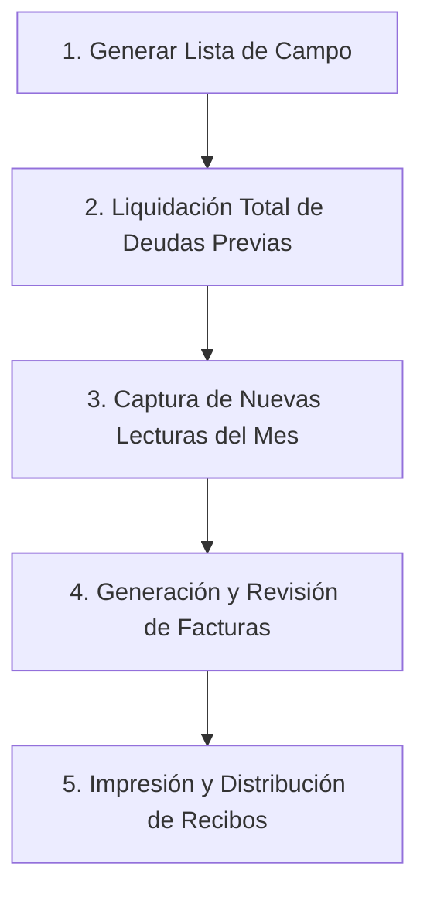

# 📅 Guía de Acción del Mes: Ciclo Completo de Operación

Esta guía es el **manual normativo y operativo principal** para coordinar el trabajo de campo y ventanilla durante el cierre e inicio de cada periodo mensual de cobro de agua en **AguaVP**.

El éxito del ciclo mensual depende de seguir estrictamente el orden de las **5 fases operativas** para evitar desfases en los saldos de los clientes y mantener la integridad contable del municipio.

---

## 🗺️ Resumen del Ciclo Operativo Mensual

---

## 1️⃣ Fase 1: Generación de la Lista de Toma de Lecturas en Campo

Antes de que el personal de campo salga a tomar lecturas en las calles y colonias, se debe imprimir la **Lista de Lecturas** con el registro de la lectura anterior de cada medidor.

### Pasos para generar la lista:
1. Diríjase al menú lateral y seleccione **Impresión > Reportes y Listas**.
2. Seleccione el **Pueblo / Localidad** y el **Periodo (Mes y Año)** correspondiente.
3. Haga clic en **"Vista Previa"** o **"Imprimir"**.
4. Se abrirá una ventana modal con el formato de captura para los lectores.

> [!IMPORTANT]
> **Verificación previa**: Es fundamental comprobar que la columna **"LECT. ANT."** (Lectura Anterior) contenga los valores correctos antes de entregar el formato al personal de campo.

---

## 2️⃣ Fase 2: Proceso de Liquidación de Deudas Previas

> [!CAUTION]
> **Regla de Oro Operativa**: Es **obligatorio** realizar el corte y liquidación de adeudos del periodo anterior **antes** de registrar las nuevas lecturas y generar facturas.  
> **Orden correcto:** Primero liquidar adeudos antiguos $
ightarrow$ después capturar la nueva lectura mensual y facturar.

Para gestionar cobros masivos y regularizar los pagos pendientes del mes anterior:

### Pasos en Liquidación Total:
1. Abra el apartado de **Liquidación Total** o **Lista de Deudores** en el módulo de **Pagos**.
2. En la lista desplegada, **marque únicamente a los clientes que "Siguen debiendo"**. El sistema asumirá automáticamente que todos los clientes desmarcados ya realizaron su pago.

3. Presione el botón **"Revisar y confirmar"** en la parte inferior para visualizar el resumen financiero.

4. Si los importes y conteos son correctos, presione **"Confirmar liquidación"** para asentar las operaciones.

### ⚠️ Alerta de Precaución de Cobranza en Rutas (`validarCobranzaPeriodo`)
Si un operador intenta generar facturas de una ruta sin haber liquidado el mes anterior y el sistema detecta un alto porcentaje de recibos sin pagar, se disparará una ventana modal de advertencia:

> *"¡Se detectó un alto índice de facturas sin pagar del período anterior! Han quedado pendientes X de Y facturas (Z%). Si generas los recibos ahora, los usuarios acumularán el mes sin que se haya procesado su pago previo."*

Se recomienda detener la facturación, procesar la liquidación en caja y posteriormente retomar la emisión de facturas.

---

## 3️⃣ Fase 3: Captura de las Nuevas Lecturas del Mes

Una vez que las cuadrillas regresan de campo con las hojas de ruta completadas:

1. Diríjase al módulo de **Lecturas**.
2. Seleccione la ruta correspondiente y presione **"Tomar Lecturas"**.
3. Se abrirá el **Carrusel de Lecturas a Pantalla Completa**.
4. Ingrese el valor numérico en $m^3$ observado en el medidor.
5. El sistema calculará en tiempo real el consumo: $\text{Consumo} = \text{Lectura Actual} - \text{Lectura Anterior}$.
6. Presione **Enter** o **"Guardar y Siguiente"** para avanzar automáticamente al siguiente predio.

---

## 4️⃣ Fase 4: Generación y Revisión de Facturas

Cuando el avance de la ruta alcance el **100%**:

1. El botón de la tarjeta cambiará a color verde: **"Generar Facturas"**.
2. Presione el botón para abrir el modal de confirmación.
3. El sistema aplicará la estructura tarifaria correspondiente a cada usuario y generará las facturas en la base de datos.
4. Se desplegará el **Visualizador de Resultados** con el listado detallado de recibos creados y montos totales calculados.

---

## 5️⃣ Fase 5: Impresión y Distribución de Recibos

Para concluir el ciclo mensual y entregar los comprobantes de cobro a la ciudadanía:

1. Ingrese a **Impresión > Impresión de Recibos**.
2. Seleccione el **Pueblo / Localidad**, la **Ruta** y el **Periodo Facturado**.
3. Seleccione el formato de impresión deseado (Térmico o Carta).
4. Envíe los recibos a la impresora municipal para su entrega domiciliaria.

---

## ⚡ Recomendaciones Finales

> [!TIP]
> **Trazabilidad Continua**: Mantenga un archivo digital de las listas de campo firmadas por los lecturistas para cualquier aclaración ciudadana en ventanilla.
