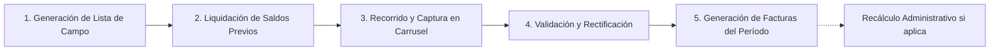

# 📖 Introducción al Módulo de Lecturas y Rutas

El módulo de **Lecturas** es el corazón operativo de la micromedición en **AguaVP**. Su propósito es estructurar las rutas de campo, registrar las lecturas mensuales del odómetro de cada medidor, calcular con precisión matemática los metros cúbicos ($m^3$) consumidos y transformar dichos registros en las facturas oficiales del servicio de agua potable para **Nácori Grande (`NG-`)**, **Mátape (`MP-`)** y **Adivino (`AD-`)**.

---

## 🗺️ Ciclo Operativo Mensual de Micromedición

---

## 🧭 Estructura y Navegación del Módulo

La vista principal de **Lecturas** (`TabRutas`) ofrece un centro de control intuitivo para supervisar el progreso de captura de todo el municipio:

### 1. Panel de Indicadores Analíticos (KPIs en Tiempo Real)
En la parte superior se presentan cuatro tarjetas dinámicas que resumen el estado del ciclo mensual:

| Indicador KPI | Código Color | Significado y Utilidad Operativa |
| :--- | :---: | :--- |
| **Total Rutas** | 🟡 Ámbar | Cantidad total de rutas configuradas y activas en el período actual. |
| **Completadas** | 🟢 Esmeralda | Rutas donde se han capturado el $100\%$ de las lecturas de los medidores asignados. |
| **Pendientes** | 🟠 Naranja | Rutas que aún tienen medidores pendientes de visita o captura en campo. |
| **Avance Global** | 🟣 Púrpura | Barra de progreso porcentual y conteo exacto de lecturas tomadas vs. total de medidores. |

---

### 2. Barra de Herramientas, Período y Filtros
* **Buscador Reactivo**: Localiza rutas al instante por su nombre oficial (ej. *"Ruta 1 - Sector Centro"*, *"Barrio Norte"*) o descripción.
* **Selector de Período Avanzado (`SelectorPeriodoAvanzado`)**: Permite conmutar fácilmente entre meses históricos cerrados o posicionarse en el período activo en curso (formato `AAAA-MM`, ej. `2026-09`).
* **Filtro por Estado de Lectura**: Segmenta las tarjetas entre *Todas*, *Solo Completadas* y *Solo Pendientes*.
* **Filtros Rápidos por Sector / Pueblo**: Píldoras de selección directa para aislar las rutas de *Nácori Grande*, *Mátape* o *Adivino*.
* **Botón "+ Nueva Ruta"**: Acceso directo al asistente de creación y trazado de nuevas rutas de medición.

---

### 3. Tarjetas de Ruta (`RutaCard`)
Cada ruta se presenta como una tarjeta modular que condensa:
* **Portada Cartográfica**: Imagen satelital representativa del pueblo con badge de sector.
* **Métricas de Cobertura**: Conteo de medidores asignados, lecturas completadas y porcentaje de avance.
* **Estado de Facturación**: Chip distintivo que indica si la ruta está *Sin Facturar*, *Facturada* o *Recalculada*.
* **Botón de Acción Principal**:
  * Si la ruta está pendiente $
ightarrow$ **"Tomar Lecturas"** (abre el carrusel interactivo).
  * Si la ruta llegó al $100\%$ $
ightarrow$ **"Generar Facturas"** (emisión de recibos) o **"Recalcular Facturación"** (si ya fue facturada pero requiere ajustes).
* **Menú de Opciones (Tres Puntos)**: Permite inspeccionar la ficha técnica y mapa de la ruta (`ModalDetalleRuta`), editar su secuencia de predios (`ModalEditarRuta`) o eliminarla.

---

## ⚡ Buenas Prácticas de Operación

> [!IMPORTANT]
> **Regla de Oro: Liquidación de Deudas Previas**: Antes de iniciar la captura de nuevas lecturas y emitir las facturas del mes en curso, es indispensable realizar el proceso de **Liquidación Total** de adeudos del período anterior en el módulo de Pagos. De lo contrario, el sistema emitirá alertas de precaución de cobranza para evitar arrastrar saldos no regularizados.

> [!TIP]
> **Orden Natural de Recorrido**: Al diseñar una ruta, configure el orden de los medidores siguiendo la secuencia física de los predios en la calle para agilizar el desplazamiento de la cuadrilla de campo.
