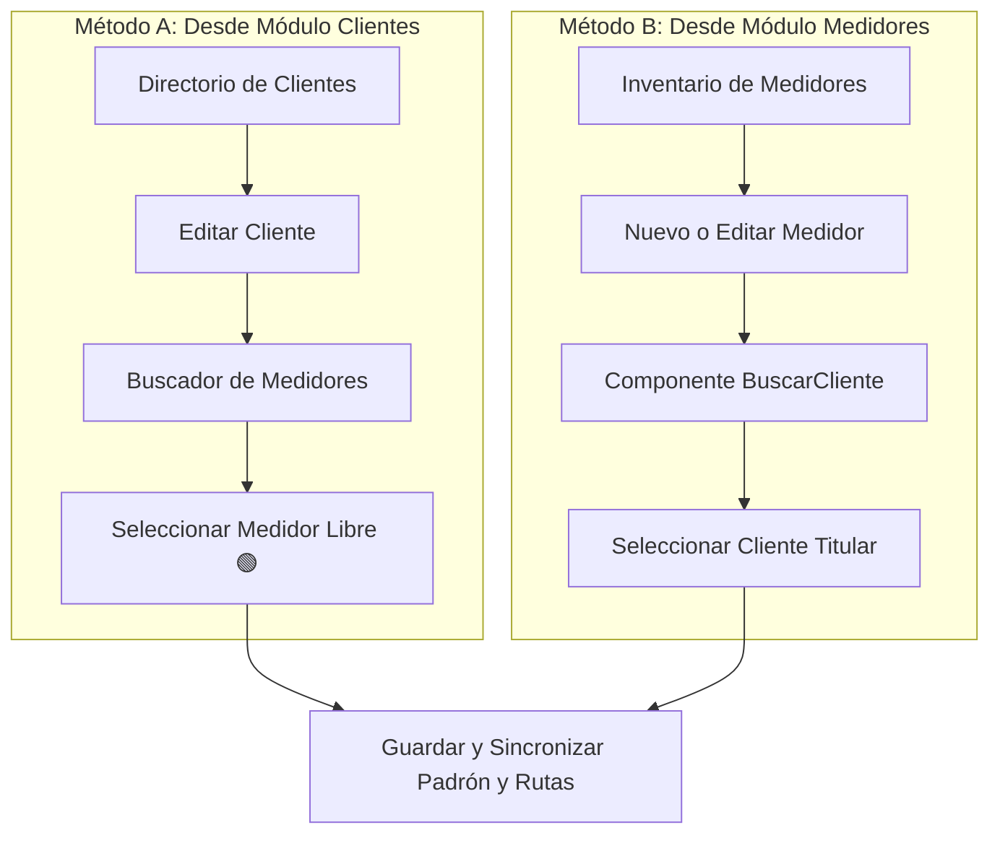

# 🔗 Asignación de Medidores a Clientes

Para que un contrato de agua facture mediante **micromedición real** ($m^3$) en lugar de una cuota fija estimada, debe existir una vinculación formal en la base de datos entre el expediente del **Cliente** y el hardware del **Medidor**.

---

## 📋 Condiciones y Reglas de Vinculación

Antes de asignar un medidor a un cliente, verifique que se cumplan las siguientes condiciones operativas:

1. **Estado del Cliente**: El cliente debe estar registrado en el padrón con estado *Activo* y contar con una tarifa asignada (Doméstica, Comercial, etc.).
2. **Disponibilidad del Medidor**: El equipo debe tener estado físico *Activo* y no debe estar vinculado simultáneamente a otro contrato.
3. **Lectura de Arranque**: Conozca la lectura actual de la carátula al momento de la conexión física para garantizar un cobro justo en el primer mes de servicio.

---

## 🔄 Métodos Oficiales de Asignación

El sistema **AguaVP** permite realizar la vinculación desde dos puntos de acceso según el flujo de trabajo del operador:

---

### Método A: Asignación desde el Módulo de Clientes

Es el método habitual cuando se da de alta un nuevo contrato de agua o se regulariza una toma existente:

1. Diríjase a **Clientes > Directorio de Clientes**.
2. Localice al usuario y presione el botón **Editar (✏️)**.
3. Desplácese hasta la sección **"Gestión de Medidor"** (`BuscarMedidor`).
4. Escriba la serie del medidor en el buscador.

#### 🏷️ Interpretación de los Chips de Disponibilidad:

| Chip | Color | Significado | ¿Se puede vincular? |
| :---: | :---: | :--- | :---: |
| **Libre** | 🟢 Verde | Medidor disponible en inventario/bodega sin contrato activo. | **Sí** (Disponible para asignación) |
| **Actual** | 🔵 Índigo | Medidor que ya está asignado actualmente a este mismo cliente. | **Sí** (Se mantiene vinculado) |
| **Ocupado** | 🔴 Rojo | Medidor instalado y activo en el contrato de otro usuario. | **No** (Bloqueado por el sistema) |

5. Haga clic sobre el medidor con chip verde **Libre**. El equipo se agregará a la lista de medidores seleccionados.
6. Presione **"Actualizar Cliente"** para confirmar los cambios.

---

### Método B: Asignación desde el Módulo de Medidores

Es el método ideal cuando se adquiere un lote de medidores o se registran instalaciones recién ejecutadas por las cuadrillas de fontanería:

1. Ingrese a **Medidores > Inventario General**.
2. Presione **"+ Nuevo Medidor"** (para alta nueva) o el botón **Modificar (⚙️)** en un medidor existente.
3. En el bloque **"Asignación de Cliente"**, utilice el buscador reactivo `BuscarCliente`.
4. Escriba el nombre, número de predio o dirección del titular.

5. Haga clic sobre la tarjeta del cliente seleccionado. Aparecerá el indicador de confirmación verde.
6. Guarde el formulario. El medidor pasará automáticamente a estado **Asignado**.

---

## 🏢 Predios con Múltiples Medidores

El sistema permite que un mismo cliente titular tenga vinculados **dos o más medidores** bajo su misma cuenta (por ejemplo, cuando un usuario es dueño de una vivienda y un local comercial en el mismo predio, o cuenta con una toma secundaria para jardín/ganadería):

* En el expediente del cliente aparecerá la relación de todos los medidores asociados.
* Durante el ciclo de lecturas mensual, el sistema generará los renglones correspondientes para capturar el consumo de cada equipo de forma independiente.
* En la factura mensual se desglosará el consumo individual de cada medidor y el total consolidado a pagar.

---

## ⚠️ Advertencias de Integridad

> [!IMPORTANT]
> **Medidores Ocupados**: El sistema no permite asignar un medidor con chip rojo **"Ocupado"** a otro usuario de forma directa. Si un medidor cambió de dueño o de predio, primero debe realizarse el proceso de **Liberación de Medidor** en la cuenta anterior.
