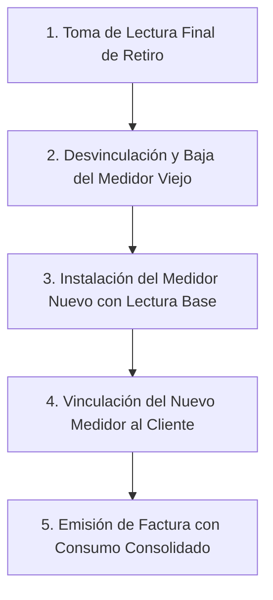

# 🔄 Reasignación, Reemplazo y Liberación de Medidores

En la operación cotidiana de las redes de agua potable, es común que los medidores requieran mantenimiento, sean retirados por rotura o sarro, o deban transferirse a otros domicilios. Este documento detalla los **protocolos normativos** para liberar, reemplazar y desactivar equipos protegiendo la integridad de los datos históricos.

---

## 🗺️ Protocolo de Reemplazo de Medidor Dañado (Swap)

Cuando un medidor se descompone, tiene la carátula ilegible o presenta fuga mecánica interna, debe sustituirse por un medidor nuevo siguiendo estrictamente este orden:

### Paso 1: Captura de la Lectura Final de Retiro
Antes de desacoplar el medidor averiado de la tubería, el fontanero debe anotar la **última lectura visible** del odómetro. Este valor se utilizará para facturar el agua consumida desde el último corte hasta el día del retiro.

### Paso 2: Liberar y Desactivar el Medidor Antiguo
1. Ingrese a **Clientes > Directorio de Clientes** y localice al usuario.
2. En la ficha de edición, retire el medidor dañado presionando la opción de desvincular.
3. Diríjase a **Medidores > Inventario**, localice el medidor retirado y cambie su estado a `Inactivo` o `Retirado`.

### Paso 3: Alta o Selección del Medidor Nuevo
1. Si el nuevo medidor no estaba registrado en inventario, presione **"+ Nuevo Medidor"** en el módulo de Medidores.
2. Registre la serie troquelada, marca, modelo y la **Lectura Base de Arranque** (habitualmente `0` $m^3$).

### Paso 4: Vinculación al Contrato del Cliente
1. Asigne el nuevo medidor al cliente (desde el módulo de Clientes o desde el formulario del medidor).
2. El cliente quedará vinculado al nuevo equipo sin perder el historial de recibos pagados con el medidor anterior.

---

## 🔓 Protocolo de Liberación de Medidor

La liberación desvincula un medidor de un cliente para regresarlo a bodega como equipo disponible sin eliminarlo del sistema:

1. Abra el formulario de edición del cliente o del medidor.
2. Desvincule la relación cliente-medidor.
3. El medidor pasará a mostrar el chip verde **"Disponible"** en el inventario general.
4. Las facturas anteriores emitidas a nombre del cliente conservarán el registro histórico del número de serie que tenía instalado en ese mes.

---

## 🗑️ Desactivación de Medidores y Papelera de Reciclaje

Cuando un equipo queda inservible de forma permanente (carcasa rota, mecanismo fundido, obsolescencia tecnológica), se debe enviar a la **Papelera de Medidores**.

### Requisitos y Condiciones de Desactivación:
1. **Regla de Bloqueo por Asignación**: El medidor **NO debe estar asignado a ningún cliente activo**. Si intenta eliminar un medidor en servicio, el sistema mostrará el error:
   > *"No se puede eliminar el medidor porque está asignado a un cliente activo. Libérelo primero."*
2. **Justificación Técnica Obligatoria**: Al presionar el botón **🗑️ Eliminar**, se desplegará el modal de desactivación donde es **obligatorio escribir el motivo de la baja (mínimo 10 caracteres)** (ej. *"Carcasa fracturada por congelamiento, mecanismo inservible"*).

---

## ♻️ Gestión de la Papelera de Medidores

En la pestaña **Inventario General**, presione el botón superior **"📁 Papelera"** para acceder al registro de equipos desactivados:

### 1. Restaurar Medidor (`handleRestoreMedidor`)
* Si un equipo fue desactivado por error o fue reparado en taller, presione el botón verde **Restaurar**.
* El sistema solicitará confirmación y reactivará el medidor devolviéndolo al inventario activo con todas sus características y coordenadas originales.

### 2. Purga Definitiva Permanente (`handlePurgeMedidor`)
* La purga borra el registro de forma absoluta e irreversible de la base de datos.
* **Control de Integridad Referencial**: Si el medidor cuenta con lecturas mensuales capturadas o recibos históricos asociados en auditorías previas, el sistema **bloqueará la purga definitiva** para proteger la contabilidad del municipio, recomendando mantenerlo desactivado en la papelera.

---

## ⚡ Buenas Prácticas

> [!WARNING]
> **No borre medidores con historial**: Mantenga los medidores dados de baja en la papelera o con estado `Retirado` en lugar de forzar su purga, garantizando que los reportes de auditoría de años anteriores sigan mostrando la información verídica de la toma.
