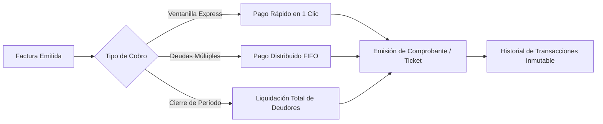

# 💳 Introducción al Módulo de Pagos y Cobranza

El módulo de **Pagos y Cobranza** es la ventanilla financiera del sistema **AguaVP**. Su función principal es registrar y certificar la totalidad de los ingresos municipales por suministro de agua potable, controlar las cuentas por cobrar, aplicar liquidaciones masivas de deudores y mantener la bitácora inmutable de transacciones para **Nácori Grande**, **Mátape** y **Adivino**.

---

## 🗺️ Flujo General de Ingresos y Cobranza

---

## 🧭 Estructura y Pestañas del Módulo (`PagosVista`)

El módulo integra cuatro pestañas operativas diseñadas para cubrir todas las necesidades de caja:

### 1. Cobranza por Cliente (`TabCobranzaCliente`) — Pestaña Principal
* Mesa de trabajo central donde se gestiona la cartera de usuarios.
* Permite ordenar a los clientes por ranking de deuda, buscar por predio, consultar expedientes digitales completos y ejecutar la **Liquidación Total** de deudores del período.

### 2. Facturas (`TabFacturas`)
* Inventario detallado de todos los recibos emitidos mes con mes.
* Permite consultar consumos en $m^3$, saldos pendientes y aplicar cobros directos por folio de factura.

### 3. Historial de Pagos (`TabPagos`)
* Bitácora contable de todas las transacciones cobradas en caja con número de folio (`#P-...`), fecha, hora, método de cobro y cajero responsable.

### 4. Estadísticas y Recaudación (`TabEstadisticas`)
* Panel de analítica financiera que compara los montos facturados contra los ingresos reales recaudados, evaluando la eficiencia de cobranza municipal.

---

## 📊 Panel de Indicadores de Caja (KPIs en Tiempo Real)

| Indicador KPI | Código Color | Significado Financiero |
| :--- | :---: | :--- |
| **Recaudado Total** | 🟢 Esmeralda | Monto acumulado cobrado en caja ($ MXN) durante el período consultado. |
| **Operaciones** | 🔵 Azul | Cantidad de transacciones de cobro formalizadas exitosamente. |
| **Promedio por Pago** | 🟣 Púrpura | Ticket promedio cobrado por transacción en ventanilla. |
| **Efectividad de Recaudo** | 🟦 Verde Azulado | Porcentaje de recuperación financiera sobre el total facturado esperado. |

---

## ⚡ Buenas Prácticas de Operación

> [!IMPORTANT]
> **Liquidación de Saldos Previos**: Realice siempre el corte y liquidación masiva del período anterior antes de capturar las lecturas del nuevo mes para evitar arrastrar adeudos desactualizados.

> [!TIP]
> **Atención Ágil**: Utilice **Pago Rápido** para usuarios que liquidan su recibo mensual corriente y **Pago Distribuido** cuando el cliente abone a una cuenta con múltiples meses vencidos.
