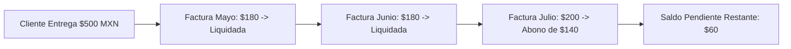

# 🔄 Registro de Pagos y Abonos Distribuidos

Cuando un cliente presenta un saldo acumulado de varios meses o desea realizar un abono parcial a su cuenta, el sistema **AguaVP** utiliza el algoritmo de **Pago Distribuido por Cliente** (`ModalPagoDistribuidoCliente`).

---

## 🧠 El Principio de Reparto FIFO (First-In, First-Out)

Para garantizar la justicia fiscal y evitar que las deudas más antiguas prescriban, el sistema aplica automáticamente el criterio **FIFO**:

1. El sistema ordena todas las facturas pendientes del cliente de la más antigua a la más reciente.
2. El monto en dinero entregado por el usuario se reparte liquidando al $100\%$ las facturas más viejas.
3. Si queda un remanente menor al total de la siguiente factura, se aplica como **abono parcial**, reduciendo su saldo pendiente.

---

## 📋 Pasos para Aplicar un Pago Distribuido

1. En la pestaña **Cobranza por Cliente**, presione el botón **💳 Cobro por Cliente** en la fila del usuario.
2. Se abrirá la pasarela de pago distribuido:

3. **Ingresar Monto a Pagar**: Escriba la cantidad entregada por el cliente (ej. $600.00).
4. **Previsualización del Reparto**: Observe en la tabla inferior cómo se distribuye el dinero entre cada una de las facturas adeudadas.

5. **Seleccionar Método de Pago**: Efectivo, Transferencia o Tarjeta.
6. Presione **"Confirmar Pago Distribuido"**.
7. Se emitirá el comprobante oficial con el desglose de todas las facturas amortizadas.
