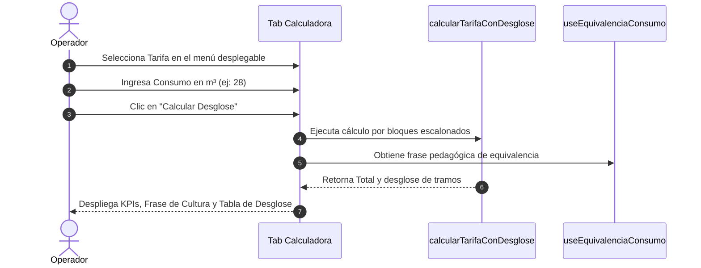

# Calculadora y Simulador de Tarifas

La pestaña **Calculadora** es una herramienta de simulación en tiempo real que reproduce fielmente el algoritmo del motor de facturación de **AguaVP**. Su objetivo es permitir a los operadores, cajeros y directores verificar el desglose exacto de un cobro antes de emitir recibos oficiales o responder a dudas de usuarios en ventanilla.

---

## 🛠️ Cómo Utilizar el Simulador Paso a Paso

1. Ingrese al módulo de **Tarifas** y seleccione la pestaña **Calculadora**.
2. **Seleccione la Tarifa**: En el panel izquierdo *Parámetros*, elija la tarifa que desea simular (ej: *Tarifa Residencial 2026*).
3. **Ingrese el Consumo ($m^3$)**: Escriba el volumen de agua a calcular (admite valores decimales).
4. **Presione "Calcular Desglose"**: El sistema procesará la solicitud al instante.

---

## 📊 Interpretación de los Resultados

Al procesar la simulación, la columna derecha se actualiza con tres secciones clave:

### 1. Tarjetas de Resumen (KPIs)
* **Consumo Ingresado**: El valor numérico exacto introducido por el operador (ej: `25.5 m³`).
* **Consumo Facturable**: La parte entera facturada tras aplicar el redondeo legal hacia abajo `Math.floor()` (ej: `25 m³`).
* **Total Calculado ($)**: Importe monetario final que pagaría el usuario por concepto de consumo de agua.

---

### 2. Banner de Cultura del Agua (Equivalencia Didáctica)
Se presenta un mensaje educativo automático que traduce los metros cúbicos en analogías de la vida cotidiana:

> 💧 **Equivalencia del Consumo**: *"Su consumo equivale a 50 duchas de 10 minutos o 125 descargas de inodoro estándar."*

---

### 3. Tabla Detallada de Desglose por Escalón

La tabla descompone el importe en cada uno de los bloques aplicados:

| Columna | Significado Operativo | Ejemplo |
| :--- | :--- | :--- |
| **RANGO** | Intervalo de metros cúbicos del bloque. | `0 - 10`, `11 - 20`, `21 - 35` |
| **TIPO DE COBRO** | Categoría aplicada al tramo: `Base fija`, `Cobro por tramo` (completo o parcial). | `Base fija` |
| **METROS ($m^3$)** | Cantidad de metros cúbicos facturados dentro de este bloque específico. | `10 m³`, `5 m³` |
| **PRECIO/m³** | Costo unitario autorizado para ese escalón. | `$8.00`, `$14.00` |
| **SUBTOTAL ($)** | Importe acumulado por este escalón ($\text{Metros} \times \text{Precio}$). | `$80.00`, `$70.00` |

---

## 🎯 Casos de Uso Frecuentes

1. **Atención a Usuarios en Ventanilla**: Cuando un suscriptor acude a reclamar el importe de su recibo (*"¿Por qué subió tanto mi cuenta si solo gasté 5 metros más?"*), el cajero puede ingresar el consumo en la calculadora y mostrarle en pantalla cómo los metros extra pasaron al siguiente escalón tarifario.
2. **Auditoría de Nuevas Tarifas**: Verificación previa de nuevas tarifas aprobadas por el cabildo o comité antes de aplicarlas a la facturación masiva del mes.
3. **Cálculo de Consumos Extraordinarios**: Estimación rápida de cobros para tomas de pipas de agua, obras en construcción o eventos especiales.

---

## 💡 Recomendaciones

> [!TIP]
> **Sin Rangos Configurados**: Si intenta simular una tarifa que fue recién creada pero aún no tiene rangos de consumo registrados, el sistema mostrará un aviso de advertencia: *"La tarifa seleccionada no tiene rangos configurados."*
