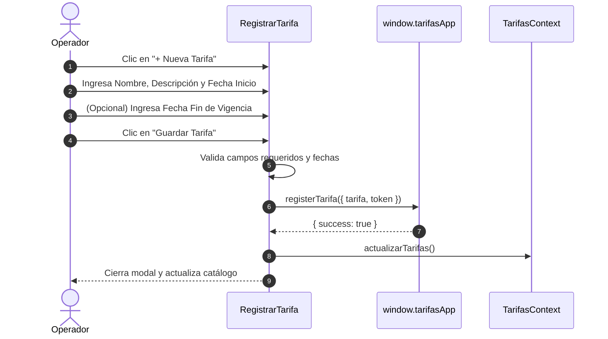

# Gestión y Registro de Tarifas

La pestaña **Tarifas** permite consultar el catálogo completo de tarifas del organismo operador, verificar su estado de vigencia, registrar nuevas tarifas y acceder a la edición de sus parámetros generales y bloques de precios.

---

## 🔍 Búsqueda y Navegación Paginada

En la parte superior de la pestaña se ubica la barra de herramientas:

1. **Buscador con Debounce (500 ms)**: Permite escribir el nombre o palabras clave de la tarifa. La búsqueda filtra automáticamente tras medio segundo de inactividad del teclado y **resetea la vista a la página 1** para evitar bloqueos por paginación fuera de rango.
2. **Botón de Limpieza (✕)**: Borra de inmediato el término de búsqueda y restaura el listado paginado completo.
3. **Paginación Inteligente**: Si el total de tarifas excede el límite por página (10 registros), se despliega el control de paginación inferior para navegar entre páginas.

---

## ➕ Cómo Registrar una Nueva Tarifa (`RegistrarTarifa`)

Para dar de alta una nueva tarifa en el sistema, presione el botón **Nueva Tarifa** ubicado en la esquina superior derecha (requiere permiso `tarifas.crear`).

### Formulario de Registro

| Campo | Tipo | Obligatorio | Descripción y Validación |
| :--- | :--- | :--- | :--- |
| **Nombre de la Tarifa** | Texto | **Sí** | Nombre descriptivo único (ej: *Tarifa Doméstica 2026*, *Tarifa Comercial Zona Centro*). |
| **Descripción** | Área de Texto | **Sí** | Detalle de aplicación, usuarios a los que está dirigida, acuerdos de cabildo o decreto aplicable. |
| **Fecha de Inicio** | Fecha (`date`) | **Sí** | Día exacto en que la tarifa entra en vigor en el sistema. |
| **Fecha de Fin** | Fecha (`date`) | No | Día en que vence la tarifa. Si se deja vacía, la tarifa se considerará de **Vigencia Indefinida**. |

> [!WARNING]
> **Validación de Fechas**: Si se especifica una `Fecha de Fin`, esta **no puede ser anterior** a la `Fecha de Inicio`. El sistema bloqueará el guardado y mostrará un aviso de error en caso de incongruencia cronológica.

---

## 🃏 Estructura de la Tarjeta de Tarifa (`TarifaCard`)

Cada tarjeta en la cuadrícula resume la configuración esencial de la tarifa:

* **Encabezado**: Nombre de la tarifa, insignia de estado (*Vigente*, *Por vencer*, *Vencida*, *Programada*, *Sin vencimiento*) y alerta adicional `≤ 30 días` si su fecha límite está próxima.
* **Período de Vigencia**: Muestra el intervalo de fechas formateado (ej: *01/01/2026 - INDEFINIDA*).
* **Descripción**: Texto informativo ingresado al registrarla.
* **Estructura de Precios**:
  * Si la tarifa **ya tiene rangos**: Muestra una tabla con los bloques de consumo ($m^3$) y el costo unitario ($/m³).
  * Si la tarifa **no tiene rangos**: Muestra un aviso de *"Sin rangos definidos"* y un botón directo para configurarlos.
* **Botón de Acción**:
  * **Nuevo Rango** (`RegistrarRango`): Si no tiene bloques configurados.
  * **Editar (✏️)** (`EditarTarifaY_Rangos`): Abre el editor de datos generales y rangos si ya cuenta con estructura.

---

## ✏️ Modificación de Datos Generales (`EditarTarifaY_Rangos`)

Al hacer clic en el botón de **Editar (✏️)** en una tarjeta de tarifa (requiere permiso `tarifas.modificar`), se abre una ventana modal con dos pestañas:

1. **Pestaña "Datos Generales"**: Permite corregir el nombre, descripción, fecha de inicio y fecha de fin.
2. **Pestaña "Bloques de Consumo"**: Permite agregar, ajustar precios o eliminar escalones de consumo (véase la guía [Rangos de Consumo y Lógica de Cálculo](Rangos%20de%20Consumo%20y%20L%C3%B3gica%20de%20C%C3%A1lculo.md)).

---

## 🔒 Control de Permisos de Seguridad

El módulo de Tarifas protege las operaciones críticas mediante el sistema de permisos de **AguaVP**:

* `tarifas.ver`: Permite consultar el catálogo y utilizar la calculadora.
* `tarifas.crear`: Habilita el botón **Nueva Tarifa**.
* `tarifas.modificar`: Habilita el botón de edición y la gestión de rangos.
