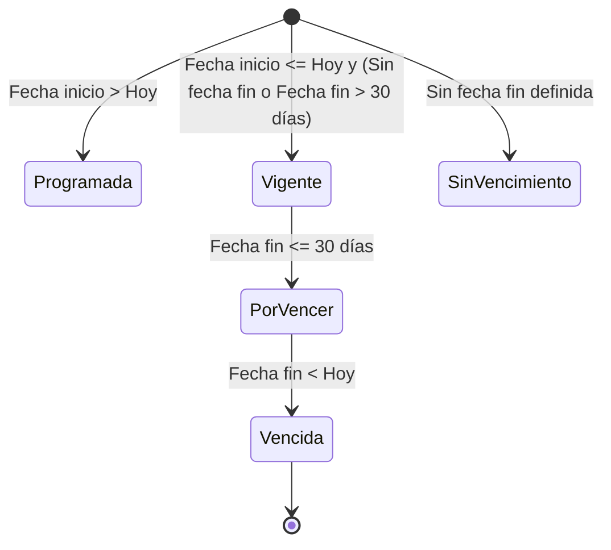
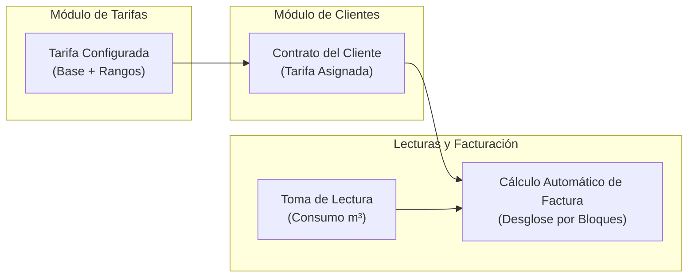

# Introducción al Módulo de Tarifas

El módulo de **Tarifas** es el componente de **AguaVP** encargado de definir, administrar y simular las estructuras de precios utilizadas para calcular el cobro del servicio de agua potable a los usuarios de la red.

Permite configurar esquemas de cobro flexibles mediante cuotas fijas base y bloques de consumo escalonados, adaptándose a diversas categorías de contratos (como *Doméstica*, *Comercial*, *Industrial* o *Institucional*), así como controlar la vigencia temporal de cada tarifa en cumplimiento con las leyes de ingresos municipales o acuerdos comunitarios.

---

## 📑 Pestañas del Módulo

La interfaz de **Tarifas** se organiza en dos pestañas principales:

| Pestaña | Propósito Operativo | Funciones Clave |
| :--- | :--- | :--- |
| **💵 Tarifas** | Catálogo general de estructuras de cobro registradas en el sistema. | Búsqueda debounced, tarjetas de tarifa con estado de vigencia, alta de nuevas tarifas y edición de rangos de consumo. |
| **🧮 Calculadora** | Simulador interactivo de cobro en tiempo real. | Prueba de consumos en $m^3$, desglose analítico tramo por tramo y verificación de frases de cultura del agua. |

---

## 📊 Métricas y Estadísticas Globales (KPIs)

En la cabecera de la pantalla se despliegan cuatro indicadores en tiempo real:

* **📁 Total Tarifas**: Cantidad global de tarifas registradas en la base de datos.
* **🟢 Vigentes**: Tarifas activas cuya fecha de fin es nula (indefinida) o posterior a la fecha actual.
* **📈 Base Promedio ($)**: Promedio aritmético del costo del primer rango (cuota base) de todas las tarifas vigentes.
* **🟡 Por Vencer**: Tarifas cuya fecha límite de vigencia expira dentro de los próximos **30 días**, alertando a la administración sobre la necesidad de actualización o renovación de convenios.

---

## 📅 Ciclo de Vida y Estados de Vigencia

Cada tarifa en **AguaVP** es evaluada dinámicamente según la fecha del sistema frente a su fecha de inicio y fecha de fin:

| Estado | Insignia Visual | Condición Operativa |
| :--- | :--- | :--- |
| **🟢 Vigente** | Verde Esmeralda | Tarifa en período activo normal con fecha de vencimiento lejana. |
| **🟢 Sin vencimiento** | Verde Esmeralda | Tarifa por tiempo indefinido (`fecha_fin` vacía). |
| **🟡 Por vencer** | Amarillo Ámbar | La tarifa expirará en **30 días o menos**. Muestra advertencia visual en tarjeta. |
| **🔵 Programada** | Azul Cielo | Tarifa configurada para entrar en vigor en una fecha futura. |
| **🔴 Vencida** | Rojo Carmesí | La fecha de fin ha pasado. No debe asignarse a nuevos contratos. |

---

## 🔄 Integración con el Resto del Sistema

El módulo de Tarifas actúa como el motor de precios para todo el flujo operativo de **AguaVP**:

---

## 💡 Recomendaciones Operativas

> [!TIP]
> **Pruebe siempre en la Calculadora**: Antes de asignar una tarifa nueva a los contratos de los usuarios o de autorizar una actualización de precios, realice simulaciones en la pestaña **Calculadora** con consumos típicos (ej: 10, 25 y 45 $m^3$) para comprobar que el desglose coincide exactamente con el tabulador oficial.

> [!IMPORTANT]
> **Continuidad de Rangos**: Toda tarifa requiere tener al menos un rango registrado para poder ser utilizada en la facturación. El primer rango siempre debe comenzar en **0 $m^3$** para fungir como cuota base del servicio.

---

## 📚 Guías de esta Sección

1. **[Gestión y Registro de Tarifas](Gesti%C3%B3n%20de%20Tarifas.md)**: Alta de tarifas, períodos de vigencia, permisos y tarjetas de administración.
2. **[Rangos de Consumo y Lógica de Cálculo](Rangos%20de%20Consumo%20y%20L%C3%B3gica%20de%20C%C3%A1lculo.md)**: Configuración de bloques, reglas de continuidad, no solapamiento y fórmula matemática.
3. **[Calculadora y Simulador de Tarifas](Calculadora%20de%20Tarifas.md)**: Simulación interactiva de cobro, auditoría de consumos y equivalencias hídricas.
