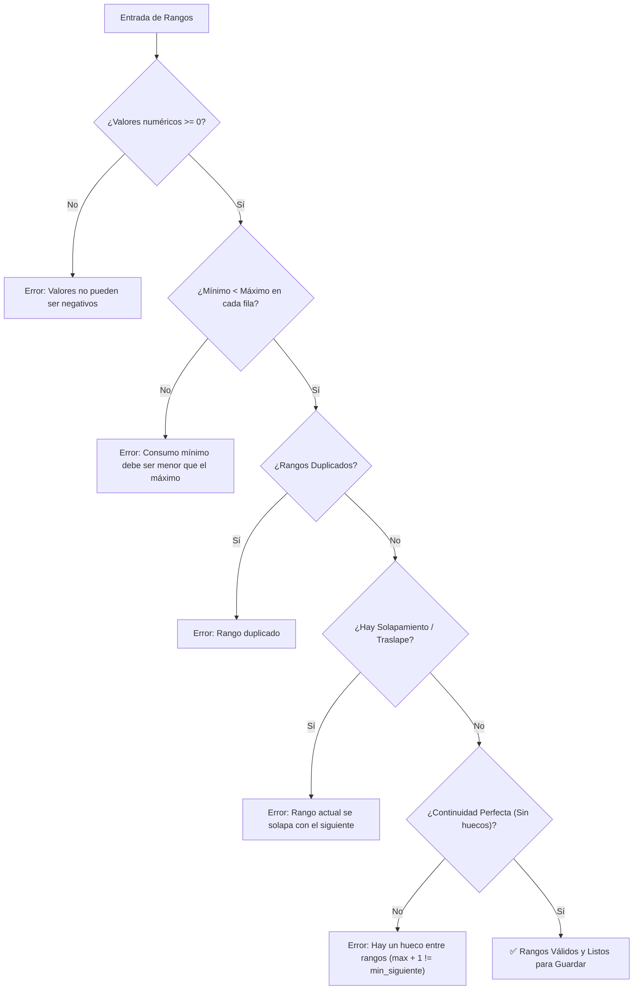
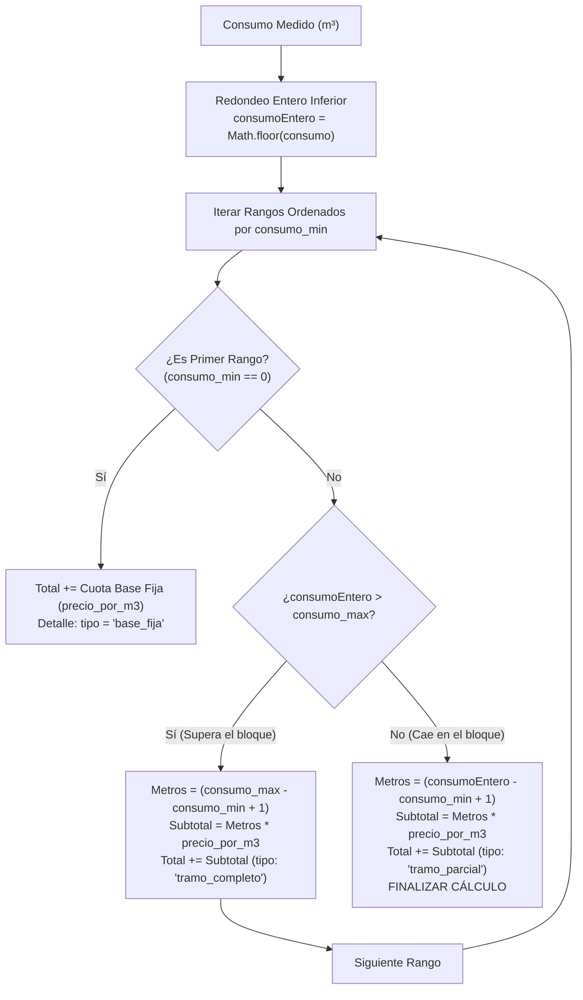

# Rangos de Consumo y Lógica de Cálculo

El cálculo de cobro en **AguaVP** se basa en un modelo tarifario progresivo por bloques de consumo. Este esquema premia el uso eficiente del agua y cobra proporcionalmente más por metro cúbico conforme aumenta el volumen consumido, promoviendo la sostenibilidad del recurso.

---

## 📐 Estructura de un Rango de Consumo

Cada escalón tarifario está compuesto por tres valores esenciales:

$$\text{Rango} = [\text{Consumo Mínimo } (m^3), \text{Consumo Máximo } (m^3), \text{Precio por } m^3 \text{ ($)}]$$

* **Consumo Mínimo ($m^3$)**: Límite inferior del bloque de volumen.
* **Consumo Máximo ($m^3$)**: Límite superior del bloque de volumen.
* **Precio por $m^3$ ($)**:
  * En el **Primer Rango ($0$ a $V_{\text{base}}$)**: Representa la **Cuota Base Fija** del servicio mensual.
  * En los **Rangos Siguientes**: Representa el costo unitario por cada metro cúbico consumido dentro de ese tramo.

---

## 🛡️ Reglas Estrictas de Validación del Sistema

Al registrar o modificar bloques de consumo (`RegistrarRango` y `EditarTarifaY_Rangos`), el motor valida de forma automática cinco reglas de integridad:

1. **Positividad**: Todos los valores de consumo y precio deben ser mayores o iguales a cero ($0.00$).
2. **Orden Interno**: En cada fila, el `consumo_min` debe ser estrictamente menor que el `consumo_max`.
3. **No Duplicidad**: No pueden existir dos filas con límites idénticos.
4. **No Solapamiento (Prohibición de Traslape)**: El `consumo_max` del rango actual debe ser estrictamente menor que el `consumo_min` del rango siguiente ($\text{Max}_i < \text{Min}_{i+1}$).
5. **Continuidad Estricta (Sin Huecos)**: No puede haber vacíos entre bloques. El `consumo_min` del siguiente rango debe ser exactamente igual al `consumo_max + 1` del rango previo (ej: $0 - 10$, $11 - 20$, $21 - 35$).

---

## 🧮 Algoritmo Matemático de Facturación

El cálculo del importe total de consumo se ejecuta en el archivo utilitario `tarifaCalculadora.js` y en el backend mediante el siguiente procedimiento:

### 1. Cuota Base (Primer Rango: $0$ a $X\ m^3$)
Cuando el rango inicia en $0$ (`consumo_min = 0`), el precio configurado se cobra como una **cuota base fija** ($C_{\text{base}}$), independientemente de si el cliente consumió $0$, $5$ o todos los $X\ m^3$ amparados por el derecho de conexión.

### 2. Tramos Completos Intermedios
Si el consumo del cliente sobrepasa el límite superior de un bloque intermedio, se factura la totalidad de los metros que contiene ese bloque:

$$\text{Metros en Bloque} = (\text{Consumo Máximo} - \text{Consumo Mínimo} + 1)$$
$$\text{Subtotal Bloque} = \text{Metros en Bloque} \times \text{Precio Unitario}$$

### 3. Tramo Parcial de Cierre
En el bloque donde se ubica el consumo final del cliente, se facturan únicamente los metros consumidos dentro de ese tramo:

$$\text{Metros Consumidos} = (\text{Consumo Entero} - \text{Consumo Mínimo} + 1)$$
$$\text{Subtotal Tramo} = \text{Metros Consumidos} \times \text{Precio Unitario}$$

### 4. Excedente Final
Si el consumo supera el límite máximo del último rango configurado, los metros excedentes se multiplican por el precio por $m^3$ del último rango.

---

## 📊 Ejemplo Numérico Exhaustivo

Supongamos la siguiente tarifa doméstica aprobada:

| Rango | Límites ($m^3$) | Precio / Cuota | Tipo de Cobro |
| :---: | :---: | :---: | :---: |
| **Rango 1** | $0 - 10\ m^3$ | **$120.00** | Cuota Base Fija (Derecho + 10 $m^3$ incluidos) |
| **Rango 2** | $11 - 20\ m^3$ | **$8.00\ /m^3$** | Escalón Intermedio ($10\ m^3$ de capacidad) |
| **Rango 3** | $21 - 35\ m^3$ | **$14.00\ /m^3$** | Escalón Alto ($15\ m^3$ de capacidad) |
| **Rango 4** | $36 - 9999\ m^3$ | **$22.00\ /m^3$** | Escalón de Exceso |

### Caso A: Usuario consume $8\ m^3$ (Dentro de la Base)
* Cae en el **Rango 1** ($0 - 10$).
* **Importe**: **$120.00 MXN** (Cuota fija).

### Caso B: Usuario consume $25\ m^3$ (Consumo Moderado)
1. **Rango 1 ($0 - 10\ m^3$)**: Base fija = **$120.00**
2. **Rango 2 ($11 - 20\ m^3$)**: Tramo completo ($10\ m^3 \times \$8.00$) = **$80.00**
3. **Rango 3 ($21 - 35\ m^3$)**: Tramo parcial ($25 - 21 + 1 = 5\ m^3 \times \$14.00$) = **$70.00**
* **Total a Cobrar**: $\$120.00 + \$80.00 + \$70.00 =$ **$270.00 MXN**

### Caso C: Usuario consume $42\ m^3$ (Alto Consumo)
1. **Rango 1 ($0 - 10\ m^3$)**: Base fija = **$120.00**
2. **Rango 2 ($11 - 20\ m^3$)**: Tramo completo ($10\ m^3 \times \$8.00$) = **$80.00**
3. **Rango 3 ($21 - 35\ m^3$)**: Tramo completo ($15\ m^3 \times \$14.00$) = **$210.00**
4. **Rango 4 ($36 - 9999\ m^3$)**: Tramo parcial ($42 - 36 + 1 = 7\ m^3 \times \$22.00$) = **$154.00**
* **Total a Cobrar**: $\$120.00 + \$80.00 + \$210.00 + \$154.00 =$ **$564.00 MXN**
